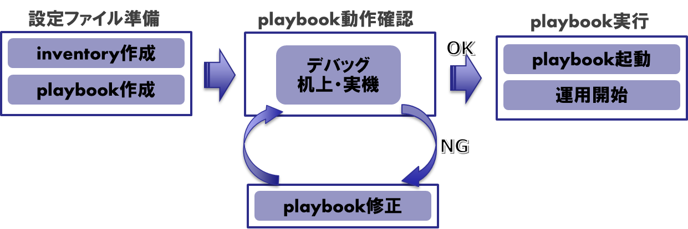
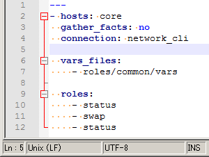

[→目次に戻る](/README.md)

# 3. playbookの作成

## 3章概要
- [3.1 playbook作成の流れ](#31-playbook作成の流れ)
- [3.2 inventoryとplaybook](#32-inventoryとplaybook)
- [3.3 基本的なモジュール，ディレクティブ，プラグインの記述サンプル](#33-基本的なモジュールディレクティブプラグインの記述サンプル)
- [3.4 playbook作成のノウハウ](#34-playbook作成のノウハウ)
- [3.5 AXモジュールの使用上の注意事項](#35-axモジュールの使用上の注意事項)


## 3.1 playbook作成の流れ

playbookの作成作業全体の流れを以下に示します。まずAnsibleに必要となる設定ファイル(inventoryの作成、playboookの作成)を準備します。次に作成したplaybookの動作確認をおこないます。ここで期待する動作にならない場合は、playbookを修正します。十分に動作確認をして期待する動作になった場合は、運用フェースに移行してplaybookの起動から運用開始という流れになります。本章ではplaybookの作成についての内容を中心に解説します。




## 3.2 inventoryとplaybook

Ansibleを動作させるために必要となる設定ファイルを以下に示します。構成管理をおこなうにあたり、管理者が作成する必要があるファイルは、inventoryとplaybookの2つです。

**表 3.2‑1 Ansibleの設定ファイル**

|Ansibleの設定ファイル |説明 |
|------------|----|
|inventory   |実行対象の管理対象装置を設定するファイル |
|playbook    |実行したい処理の流れを記述したファイル |
|ansible.cfg |Ansible自体の設定を記述した設定ファイル |

### (1) inventoryの記述例

inventoryファイルは管理対象装置のIPアドレスやホスト名やグループ名を記述します。例として以下のような内容のファイルを作成します。/etc/ansible/hosts に作成すると、コマンドラインオプションで指定しなくても Ansible が自動的に読み込んでくれます。

**inventory記述例**
```
[all:children]
core
edge

[core]
10.100.1.101
10.100.1.102

[edge]
10.100.1.201
10.100.1.202
```

"\[core\]"、"\[edge\]"は、管理対象装置をグループ化するための記述です。"children"でグループをまとめることが可能です。


### (2) playbookの記述例

playbookファイルは管理対象装置にコマンドや設定を実行するためにタスクを記述します。playbookはYAMLを使用して記述します。YAMLは、読みやすく・書きやすく・分かりやすいという特徴があります。またYAMLはインデントを使ってデータの階層構造を表現するため、YAMLを読み書きしやすいエディタを使用することを推奨します。

《参考》 ： Notepad++　(Windows)
- インデントの階層に合わせての表示やインデント合わせができます。
- キーワードのカラーリング、階層ごとの折り返し表示ができ可読性が向上します。



playbookの記述例を以下に示します。このplaybookでは、管理対象装置に対して、運用コマンド「show version」を実行して、debugモジュールを使用しその実行結果を表示させます。

**playbookの記述例**
```yaml
- hosts: core             # (1) 管理対象装置・グループの指定
  gather_facts: no        # (2) factsの自動収集を無効化
  connection: network_cli # (3) コネクション方法：network_cliを指定

  vars:                                       # (4) 認証情報の設定 ★ コネクション方法：network_cliを使用するための変数を定義
    ansible_network_os: ax                    # AlaxalA装置を指定する場合は‘ax’を指定
    ansible_user: <ユーザ名>                   # SSHで装置ログインするユーザ名
    ansible_password: <パスワード>             # SSHで装置ログインする際のパスワード指定
    ansible_become: yes                       # 特権モード(＊)で実行の場合は ‘yes’に指定
    ansible_become_method: enable             # 特権モード(＊)移行コマンド ‘enable’を指定
    ansible_become_pass: <特権ユーザパスワード> # 特権モード(＊)のパスワード指定

  tasks:
    - name: show version  # (5) AXモジュールを実行
      ax_command:
        commands:
          - show version
      register: result    # (6) モジュールの実行結果をresult変数に保存

    - name: debug  # (7) debugモジュールでresult変数の内容を表示
      debug:
        var: result
```

\*：「特権モード」はAlaxalA装置の「装置管理者モード」と同義です。

- (1)「hosts:」,(2)「gather_facts:」,(3)「connection:」は管理対象装置を指定するtargetsセクションです。
- (4) 「vars:」は変数を定義するvarsセクションです。
- (5), (6), (7)「tasks:」は具体的な処理を定義するtasksセクションです。

　YAMLの構文については、以下のサイトをご参照ください。

[https://docs.ansible.com/ansible/latest/reference_appendices/YAMLSyntax.html](https://docs.ansible.com/ansible/latest/reference_appendices/YAMLSyntax.html)


### (3) playbookの実行例

playbookを実行した例を以下に示します。このplaybookでは、管理対象装置に対して、運用コマンド「show version」を実行して、debugモジュールを使用しその実行結果を表示させています。

**playbookの実行例**

```yaml
$ ansible-playbook sample.yml

PLAY [AX3660S] **********************************************************************************************************************

TASK [show version] *****************************************************************************************************************
ok: [AX3660S]
TASK [debug] ************************************************************************************************************************
ok: [AX3660S] => {
    "result": {
        "ansible_facts": {
            "discovered_interpreter_python": "/usr/bin/python"
        },
        "changed": false,
        "failed": false,
        "stdout": [
            "Date 2019/09/27 13:50:21 JST\nModel: AX3660S-48T4XW\nS/W: OS-L3M Ver. 12.1.H \n
            H/W: Main board\n       
            AX-3660-48T4XW [TB03G048T4X0S408AH1Z074:SL-L3A-001:730F01:0:612:11B567]\n       
            Model No.: AX-3660-48T4XW\n     Power slot 1 PS-M(AC)\n       
            AX-F2430-PSA06 [M338SA000JAAP]\n     Power slot 2 PS-M(AC)\n       
            AX-F2430-PSA06 [M338S1000FAAP]\n     Fan slot     FAN-M\n       
            AX-F2430-FAN04 [TA0FAN040000C1404H3E091]"
        ],
        "stdout_lines": [
            [
                "Date 2019/09/27 13:50:21 JST",
                "Model: AX3660S-48T4XW",
                "S/W: OS-L3M Ver. 12.1.H ",
                "H/W: Main board",
                "       AX-3660-48T4XW [TB03G048T4X0S408AH1Z074:SL-L3A-001:730F01:0:612:11B567]",
                "       Model No.: AX-3660-48T4XW",
                "     Power slot 1 PS-M(AC)",
                "       AX-F2430-PSA06 [M338SA000JAAP]",
                "     Power slot 2 PS-M(AC)",
                "       AX-F2430-PSA06 [M338S1000FAAP]",
                "     Fan slot     FAN-M",
                "       AX-F2430-FAN04 [TA0FAN040000C1404H3E091]"
            ]
        ]
    }
}

PLAY RECAP *********************************************************************************************************************
AX3660S               : ok=2    changed=0    unreachable=0    failed=0    skipped=0    rescued=0    ignored=0
```


## 3.3 基本的なモジュール，ディレクティブ，プラグインの記述サンプル

基本的なplaybookを作成するうえで知っておくべき記述方法やポイントをplaybookのサンプルをもとに紹介します。なお、ここで紹介するplaybookは、具体的な処理を定義するtasksセクションに特化して記載しています。playbook全体については、サンプルplaybookを参照ください。

### 3.3.1 タスクの繰り返し処理 【with\_itemsの使い方】

with\_items は、タスクの繰り返し処理を実行するディレクティブです。

**サンプルplaybook(抜粋)**：
- 複数のインタフェースにコンフィグ設定する
- 「interface gigabitethernet 1/0/5, interface gigabitethernet 1/0/7」にVLAN 100を設定する

```yaml
tasks:
    - name: configure interface
      ax_config:
        lines:
          - switchport access vlan 100
        parents: interface gigabitethernet {{ item }}
      with_items:
        - 1/0/5
        - 1/0/7
```

上記では、with\_items を用いて、ax\_configをループ処理させています。ax\_configと同じインデントとする必要があります。

サンプルplaybookへのリンク：[3\_3\_1\_playbook\_with\_items.yml](/chapter3_playbook/3_3_1_playbook_with_items.yml)

**<<ポイント>>**
- with_itemsディレクティブを使用してタスクを記述
  - アイテムのそれぞれに対してモジュール呼び出しを繰り返します。
- interface rangeコマンドは冪等性の観点から非推奨
  - コンフィグレーション上に” interface range”が含まれないため、設定済みのインタフェースに対しても複数回コマンドが実行されます。

### 3.3.2 条件によってタスクを実行する 【whenの使い方】

when は、条件を使ってタスクの実行を制御するディレクティブです。

**サンプルplaybook(抜粋)**：ax\_facts で取得したモデルが「AX3660S-48T4XW」のときだけ、ax\_configを実行する
```yaml
tasks:
- name: gather facts
  ax_facts:
    gather_subset:
      - all

- name: configure vlan (interface)
  ax_config:
    lines:
      - "switchport trunk allowed vlan add 1010"
    parents: "interface {{ ansible_net_interfaces['1/0/10'].linespeed }} 1/0/10"
    save_when: modified
  when: "ansible_net_model == 'AX3660S-48T4XW'"
```
whenと同じインデントにあるax\_configが制御対象(実行する\/しない)となります。

サンプルplaybookへのリンク：[3\_3\_2\_playbook\_when.yml](/chapter3_playbook/3_3_2_playbook_when.yml)

**<<ポイント>>**
- when で一致した特定の条件のときだけタスクを実行
  - モデル毎に実行コマンドを変えたい、特定バージョンだけをアップデート実行などに使用できます。

### 3.3.3 ポート番号から回線速度を知る 【ax\_factsの使い方】

ax\_facts は、装置情報を収集するモジュールです。

**サンプルplaybook(抜粋)**：ポート1/0/1 の回線速度を抽出し、表示する
```yaml
tasks:
    - name: gather facts
      ax_facts:
       gather_subset:
        - interfaces

    - name: show interfaces
      ax_command:
       commands:
        - show interfaces {{ ansible_net_interfaces['1/0/1'].linespeed }} 1/0/1
```
ax_factsを用いて収集したインタフェース情報(ansible\_net\_interfaces)に、ポート番号を指定して回線速度(gigabitethernet、tengigabitethernet等)を取得しています。

サンプルplaybookへのリンク：[3\_3\_3\_playbook\_ax\_facts.yml](/chapter3_playbook/3_3_3_playbook_ax_facts.yml)

**<<ポイント>>**
- ax_factsモジュールに情報から自動生成
  - 装置内の全インタフェースの情報を取得して、別のタスクでポート番号をキーに対象ポートで使用できます。


### 3.3.4 コマンド実行結果をparseする 【TextFSMの使い方】

TextFSM は、ネットワーク装置のコマンド結果をparseするための parse\_cli\_textfsm というフィルタープラグインを搭載します。

**サンプルplaybook(抜粋)**：show portコマンドの実行結果を、TextFSMでparseし表示する
```yaml
vars:
    template_show_port: "alaxala_show_port.template"

tasks:
    - name: "show port"
      ax_command:
        commands:
          - "show port 1/0/1"
      register: show_port

    - name: parse "show port"
      set_fact:
        parse_show_port: "{{ show_port.stdout[0] | parse_cli_textfsm( template_show_port ) }}"

    - name: parse "show port" msg
      debug:
        msg: "{{ show_port.stdout[0] | parse_cli_textfsm( template_show_port ) }}"
```

`"{{ show_port.stdout[0] | parse_cli_textfsm( template_show_port ) }}"`と記述することで、`show port 1/0/1`の実行結果(show\_port.stdout\[0\])を TextFSM で parse した結果を得られます。

サンプルplaybookへのリンク：[3\_3\_4\_playbook\_textfsm.yml](/chapter3_playbook/3_3_4_playbook_textfsm.yml)

**playbook実行結果 (抜粋)**

「show port 1/0/1」を parse\_cli\_textfsm で parse した結果例
```
TASK [parse "show port” msg] **********************************************************************************
ok: [10.100.1.101] => {
    "msg": [
            "CHGR": "-/-",
            "DUPLEX": "full(auto)",
            "FCTL": "off",
            "MTU": "1568",
            "NAME": "geth1/0/1",
            "PORT": "0/ 1",
            "SPEED": "1000BASE-T",
            "STATUS": "up"
        }
    ]
}
```

**<<ポイント>>**
- TextFSMでコマンド結果をparse
  - parse_cli_textfsm プラグインとテンプレートファイルを用いて 必要な項目を抽出できます。
- TextFSMの説明は、[付録.TextFSMについて](/N18R001_Ansible_Guide_Chapter_app.md)を参照ください。

### 3.3.5 条件一致しない場合playbookを中断する 【assertの使い方】

assert は、条件が不一致の場合に、playbookの処理を停止させるモジュールです。

**サンプルplaybook(抜粋)**：ポート1/0/1の状態が\'Up\'かつ回線速度が\'1000BASE-T\'の場合だけOK それ以外はfailedとする。
```yaml
vars:
    template_show_port: "alaxala_show_port.template"

 tasks:
    - name: "show port"
      ax_command:
        commands:
          - "show port 1/0/1"
      register: show_port

    - name: parse "show port"
      set_fact:
        parse_show_port: "{{ show_port.stdout[0] | parse_cli_textfsm( template_show_port ) }}"

    - name: "assert port"
      assert:
        that:
          - "'up'  ==  '{{ parse_show_port[0].STATUS }}'"
          - "'1000BASE-T'   ==  '{{ parse_show_port[0].SPEED }}'"
```

show portで取得した値：”STATUS”および”SPEED”をチェックして、条件以外の場合はエラーで終了します。

サンプルplaybookへのリンク：[3\_3\_5\_playbook\_assert.yml](/chapter3_playbook/3_3_5_playbook_assert.yml)

**<<ポイント>>**
- assertモジュールで出力結果をチェック
  - assertを用いて指定した条件をチェックします。また複数条件の指定が可能で、すべての条件が正しいときのみ trueになります。どれか1つでも条件が不一致のときはFailedになり、以降のタスクは実行されません。
- set_factモジュールで変数に値をセット
  - 取得した結果をset\_factモジュールで変数に代入します。

### 3.3.6 実行結果をファイルに保存する 【copyの使い方】

copyモジュールを使用して、運用コマンドの出力結果をAnsibleサーバ内でファイルに保存します。

**サンプルplaybook1(抜粋)**：「show system」を実行して ファイルに保存する
```yaml
tasks:
   - name: show system
     ax_command:
       commands:
         - "show system"
     register: result

   - name: copy show system
     copy:
       content: "{{ result.stdout_lines[0] | join('\n') }}"
       dest: ./{{ inventory_hostname }}_show_system.txt
```
「show system」の実行結果をresultに保存し、変数resultの標準出力結果(リスト)を改行コード(\n)で結合してファイルに出力します。

サンプルplaybookへのリンク：[3\_3\_6\_playbook\_1\_copy\_sys.yml](/chapter3_playbook/3_3_6_playbook_1_copy_sys.yml)

**サンプルplaybook2(抜粋)**：「show port」を実行してparseした結果をJSONファイルとして保存する
```yaml
vars:
    template_show_port: "alaxala_show_port.template"

tasks:
    - name: show port
      ax_command:
        commands:
          - "show port"
      register: show_port

    - name: parse "show port"
      set_fact:
        parse_show_port: "{{ show_port.stdout[0] | parse_cli_textfsm( template_show_port ) }}"

    - name: copy file to JSON
      copy:
       content: "{{ parse_show_port | to_nice_json }}"
       dest: ./{{ inventory_hostname }}_show_port.json
```

「show port」の出力結果をJSON形式でファイル出力します。

サンプルplaybookへのリンク：[3\_3\_6\_playbook\_2\_copy\_json.yml](/chapter3_playbook/3_3_6_playbook_2_copy_json.yml)

**《ポイント》**
- copyモジュールを使用して実行結果をファイル化
  - ax\_commandモジュールでコマンドの出力結果のリストを取得します。
  - テンプレートエンジンであるJinja2を使用して、出力結果をレンタリングします。

### 3.3.7 ネットワーク装置からファイルをバックアップする 【net\_getの使い方】

net\_get は、ネットワーク装置から管理ホスト(Ansible)にファイルをコピーするモジュール<sup>[\*](#note1)</sup>です。

<small id="note1">\*：net\_getモジュールを使用するには、以下コマンドにてpythonライブラリを事前にインストールする必要があります。</small>
```
$ pip install scp
```

**サンプルplaybook(抜粋)**：scpを使用してネットワーク装置上にあるコンフィグレーションファイルを、管理ホストにバックアップします。
```yaml
tasks:
   - name: "copy file from network device to ansible controller"
     net_get:
       dest: "backup_config.cnf"
       src: "/mc0/usr/home/alaxala/backup_config.cnf"
       protocol: scp
```
本例ではSCPを指定してファイルをコピーします。

サンプルplaybookへのリンク：[3\_3\_7\_playbook\_net\_get.yml](/chapter3_playbook/3_3_7_playbook_net_get.yml)

**《ポイント》**
- net_getモジュールで管理ホストにファイルをバックアップ
  - SCPまたはSFTPを使用して、ネットワーク装置から管理ホスト(Ansible)にファイルをコピーします。


### 3.3.8 ネットワーク装置にファイルを転送する 【net\_putの使い方】

net\_put は、管理ホスト(Ansible)からネットワーク装置にファイルをコピーするモジュール<sup>[\*](#note2)</sup>です。

<small id="note1">\*：net\_putモジュールを使用するには、以下コマンドにてpythonライブラリを事前にインストールする必要があります。</small>
```
$ pip install scp
```

**サンプルplaybook(抜粋)**：scpを使用して管理ホスト上にあるイメージファイルを、ネットワーク装置に転送します。
```yaml
tasks:
   - name: "copy file from ansible controller to network device"
     net_put:
       dest: "/mc0/usr/var/update/k.img"
       src: "netbsdL3SSD-ppupdate.img"
       protocol: scp
```

本例ではSCPを指定してファイルを転送します。

サンプルplaybookへのリンク：[3\_3\_8\_playbook\_net\_put.yml](/chapter3_playbook/3_3_8_playbook_net_put.yml)

**《ポイント》**
- net_putモジュールでネットワーク装置にファイルを転送
  - SCPまたはSFTPを使用して、管理ホスト(Ansible)からネットワーク装置にファイルをコピーします。


### 3.3.9 対話形式のコマンドを実行する 【prompt, answerの使い方】

prompt, answer は、対話形式のコマンドに対して自動で返答キー入力しコマンドを実行します。

**サンプルplaybook(抜粋)**：ネットワーク装置を自動的に再起動します。
```yaml
tasks:
   - name: "reload commands that require answering a prompt"
     ax_command:
       commands:
         - command: "reload no-dump-image"
            prompt: "Restart OK?"
            answer: 'y'
```

装置再起動の運用コマンドのプロンプトに対して、自動で’ｙ’を返答して 再起動を実行します。

サンプルplaybookへのリンク：[3\_3\_9\_playbook\_prompt.yml](/chapter3_playbook/3_3_9_playbook_prompt.yml)

**《ポイント》**
- 対話形式コマンドには、prompt, answerを使用
  - 対話形式のコマンドでは、コマンド実行時のプロンプトに対して’ｙ’，’n’ または ‘\<password\>’ などを指定することで自動実行が可能になります。


### 3.3.10 ネットワーク装置を再起動し 起動完了を待つ 【\[async, poll\]，\[wait\_for\]の使い方】

- asyncは非同期処理をおこないたい場合に使用するディレクティブで、asyncにpollをつけて定期的に監視する非同期処理にすることで長時間の処理に対応することができます。
- wait\_for は指定した条件が成立するまで待機するモジュールです。

**サンプルplaybook(抜粋)**：ネットワーク装置の再起動の場合、一旦ポートが閉じたことを確認し、その後SSHポートがオープンするまで待つことで再起動したことを確認します。
```yaml
vars:
ansible_command_timeout: 1200

tasks:
    - name: "reload commands that require answering a prompt"
      ax_command:
        commands:
          - command: "reload no-dump-image"
             prompt: "Restart OK?"
             answer: 'y'
　　　async: 60
      poll: 5

    - name: "wait for booting up"
      wait_for:
        host: "{{ inventory_hostname }}"
        port: 22
        state: started
        delay: 60
```

サンプルplaybookへのリンク：[3\_3\_10\_playbook\_async\_wait\_for.yml](/chapter3_playbook/3_3_10_playbook_wait_for.yml)

**《ポイント》**

- async, pollの定期的に監視する非同期処理でSSHコネクションが切断されてもtaskを継続
  - ネットワーク装置の再起動やアップデートなどsshコネクションが切断されても処理を継続します。
- wait\_forで 指定ホスト・ポートがオープンするまで待機
  - SSHコネクションが切断されたあとも指定ホスト・ポート番号がオープンするまで待機しplaybookを継続させます。
  - タイムアウト時間を大きめに設定します。

### 3.3.11 現在時刻を取得してdebugで表示する 【now()の使い方】

- now()はjinja2で管理ホストの現在時刻を取得します。

**サンプルplaybook(抜粋)**：
```yaml
  tasks:
    - block:
      - name: get current time
        set_fact:
          curtime: "{{ now(False, '%Y-%m-%d-%H%M%S') }}"

      - name: print current time
        debug:
          var: curtime
      delegate_to: localhost
```

サンプルplaybookへのリンク：[3\_3\_11\_playbook\_get\_time.yml](/chapter3_playbook/3_3_11_playbook_get_time.yml)

**《ポイント》**

- now()を使用して現在時刻を取得してコンフィグなどをバックアップする際に時刻付きのファイル名で保存することができます。

### 3.3.12 CSVファイルにレコードされたVLAN情報を読み込んでリスト化する 【read_csvの使い方】

- read_csvはCSVファイルをリストやディクショナリとして読み込むモジュールです。

**サンプルplaybook(抜粋)**：「対象装置,VLAN ID,switchport mode」がレコードされいるCSVファイルを読み込んでリスト化します。

```yaml
  tasks:
    - name: Get AX facts info
      ax_facts:
        gather_subset: "interfaces"

    - name: Read VLAN information from CSV file
      read_csv:
        path: ./vlan.csv
      register: csv_info
      delegate_to: localhost

    - name: debug print VLAN information
      debug:
        msg: "Host: {{ item.host }}, VLAN ID: {{ item.vid }}, Mode: {{ item.mode }}, Port: {{ item.port }}"
      with_items: "{{ csv_info.list }}"
      delegate_to: localhost
```

サンプルplaybookへのリンク：[3\_3\_12\_playbook\_read\_csv.yml](/chapter3_playbook/3_3_12_playbook_read_csv.yml)

- CSVファイル (vlan.csv)

|host	|vid	|mode	|port |
|------|-----|-----|-----|
|10.7.0.101	|100	|access	|0/1 |
|10.7.0.101	|200	|trunk	|0/2 |
|10.7.0.101	|300	|trunk	|0/2 |
|10.7.0.102	|400	|access	|1/0/1 |
|10.7.0.102	|500	|trunk	|1/0/2 |
|10.7.0.102	|600	|trunk	|1/0/2 |

**《ポイント》**

- CSVファイルにレコードされている情報を読み込んで、その情報をネットワーク装置に設定することができます。

## 3.4 playbook作成のノウハウ

playbookを作成する際のノウハウを以下にまとめましたので、参考にしてください。

### 3.4.1 変数を上手に使ってplaybookの使い勝手をよくする

#### (1) playbook実行時に変数を指定

　例1: 「show system」コマンドを変数名で指定して、playbookを実行
```
$ ansible-playbook sample.yml –e "args=system"
```

**(sample.yml)**
```yaml
tasks:
  - name: command exec.
    ax_command:
      commands:
        - show "{{ args }}"
```

　例2: 「vlan\_config」情報を変数ファイル名で指定して、playbookを実行
```
$ ansible-playbook sample.yml –e "@vlan_config.yml"
```
**(sample.yml)**
```yaml
tasks:
  - name: configure vlan
    ax_config:
      lines: "{{ vlan_config }}"
      parents: vlan 10
```

**(vlan\_config.yml)**
```yaml
vlan_config:
 - state suspend
 - name UNUSED
```

#### (2) 変数の共通化

　例1: playbook全体で共通的に使うデータを変数化

**サンプルplaybook**
```yaml
vars:
  - ifport: "1/0/1"
tasks:
  - name: if shutdown
    ax_command:
      commands:
        - inactivate gigabitethernet "{{ ifport }}"

  - name: if status
    ax_command:
      commands:
        - show port "{{ ifport }}"
```

　例2:
タスク内で実施するコマンド文字列のうち、共通的なパラメータ・可変パラメータを変数化

**サンプルplaybook**
```yaml
tasks:
  - name: wait for activation
    ax_command:
      commands:
        - show "{{ arg }}"

    vars:
      - arg: "system"
```

#### (3) 前のタスクの出力結果を次のタスクの変数として使用

**サンプルplaybook**
```yaml
tasks:
  - name: show port
    ax_command:
      commands:
        - 'show port 1/0/1'
    register: show_port

  - name: parse "show port"
    set_fact:
      parse_show_port: '{{ show_port.stdout[0] | parse_cli_textfsm( template_show_port ) }}'
```

#### (4) ホストごとに変数を変更する

サンプルplaybook

　　：　VLAN設定でホストごとに\"port番号\"、\"VLAN ID\"を変更

**playbook**
```yaml
- hosts: core
  gather_facts: no
  connection: network_cli

  tasks:
  - name: gather facts
    ax_facts:
      gather_subset:
        - interfaces

  - name: configure vlan (interface)
    ax_config:
      lines:
        - "switchport trunk allowed vlan add {{ vid }}"
      parents: "interface {{ ansible_net_interfaces[ port_num ].linespeed }} {{ port_num }}"
      save_when: modified
```

**inventory**
```
[core]
10.100.1.101
10.100.1.102
```

**host\_vars (10.100.1.101.yml)**
```yaml
ansible_network_os: ax
ansible_user: alaxala
ansible_password: alaxala
ansible_become: yes
ansible_become_method: enable
ansible_become_pass: alaxala

vid: 1010
port_num: 1/0/10
```

**host\_vars (10.100.1.102.yml)**
```yaml
ansible_network_os: ax
ansible_user: alaxala
ansible_password: alaxala
ansible_become: yes
ansible_become_method: enable
ansible_become_pass: alaxala

vid: 1011
port_num: 1/0/11
```

### 3.4.2 playbook実行前のチェック

事前に各種チェックを行うことで、playbookを実行する前に不具合に気付けるようになります。

#### (1) 構文チェック 【\--syntax-check】

ansible-playbookコマンドに\"\--syntax-check\"オプションをつけて実行すると、playbookの構文をチェックできます。playbookを新規に作成した場合や修正を行った場合は、チェックすることをお勧めします。チェックのみで、playbook実行はされません。

**\--syntax-check 実行例 (構文に誤りがある場合の例)**

```
$ ansible-playbook sample.yml --syntax-check

ERROR! Syntax Error while loading YAML.


The error appears to have been in '/root/ansible_src/02_alaxala/sample/sample.yml': line 14, column 7, but maybe elsewhere in the file depending on the exact syntax problem.

The offending line appears to be:

     - name: configure interface
      ax_config: <--- ここでエラーとなっている(インデントがあっていないため)
      ^ here

exception type: <class 'yaml.parser.ParserError'>
exception: while parsing a block collection
  in "<unicode string>", line 13, column 6
did not find expected '-' indicator
  in "<unicode string>", line 14, column 7
```


#### (2) リスト一覧のチェック 【\--list-tasks】【\--list-hosts】

ansible-playbookコマンドに\"\--list\"オプションをつけて実行すると、実行されるタスクや実行するホストの一覧が表示されます。事前にリストを確認し、想定するタスクやホストがリストアップされているか、想定外のタスクやホストが含まれていないか、あらかじめチェックします。チェックのみで、playbook実行はされません。

**\--list-tasks 実行例**
```
$ ansible-playbook sample.yml --list-tasks

playbook: sample.yml

  play #1 (core): core  TAGS: []
    tasks:
      show port TAGS: []
      parse "show port" TAGS: []
      copy file to JSON TAGS: []
```

**\--list-hosts 実行例**
```
$ ansible-playbook sample.yml --list-hosts

playbook: sample.yml

  play #1 (core): core  TAGS: []
    pattern: [u'core']
    hosts (2):
      10.100.1.101
      10.100.1.102
```

### 3.4.3 playbookが期待通りに動作しないときの原因解析

#### (1) debugモジュールを使用したチェック

debugモジュールを使用することで、以下のようにplaybook内で任意のメッセージを表示したり、変数に代入された値を確認したりできます。

**サンプルplaybook**
```yaml
tasks:
    - name: gather fatcs
      ax_facts:
        gather_subset:
          - "!all"
      register: result_facts

    - name: debug
      debug: var=result_facts

    - name: debug msg
      debug: msg="debug msg"
```

**playbook 実行例**
```
TASK [debug] ***********************************************************************************
ok: [10.100.1.101] => {
    "result_facts": {
        "ansible_facts": {
            "ansible_net_gather_subset": [
                "default"
            ],
            "ansible_net_hostname": "AX3660S-1",
            "ansible_net_model": "AX3660S-48T4XW",
            "ansible_net_serialnum": "TB03G048T4X0S408AH3E086:SL-L3A-001:730F01‥",
            "ansible_net_version": "12.1.H"
        },
        "changed": false,
        "failed": false
    }
}

TASK [debug msg] ***********************************************************************************
ok: [10.100.1.101] => {
    "msg": "debug msg"
```
- 変数結果の表示は、変数"result_facts"が期待どおりの値か確認可能です。
- メッセージの表示は、どの処理まで進んだか確認可能です。

#### (2) タスクのステップ実行 【\--step】

ansible-playbook コマンドに\"\--step\"オプションをつけて実行すると、タスクをひとつずつ実行することができます。以下のコマンドで処理を進めるか選択します。

  y = そのタスクを実行する

  n = そのタスクをスキップする

  c = 残りのタスクをすべて実行する

**playbook 実行例**
```
$ ansible-playbook sample.yml --step

PLAY [core_1] ***********************************************************************************
Perform task: TASK: gather facts (N)o/(y)es/(c)ontinue: y

Perform task: TASK: gather facts (N)o/(y)es/(c)ontinue: *************************************************************************

TASK [gather facts] ***********************************************************************************
ok: [10.100.1.101]
Perform task: TASK: show interfaces (N)o/(y)es/(c)ontinue: y

Perform task: TASK: show interfaces (N)o/(y)es/(c)ontinue: **********************************************************************

TASK [show interfaces] ***********************************************************************************
ok: [10.100.1.101]

PLAY RECAP ***********************************************************************************
10.100.1.101               : ok=2    changed=0    unreachable=0    failed=0    skipped=0    rescued=0    ignored=0
```

## 3.5 AXモジュールの使用上の注意事項
AXモジュールの使用上の注意事項については、「[AX modules for Ansible 運用ガイドの3.4 使用上の注意事項](https://www.alaxala.com/jp/techinfo/archive/manual/ANSIBLE/PDF/1_3/OP-GUIDE-SOFT-AM-2303_R3.pdf#page=45)」 を参照してください。

[→4.各ユースケースでのサンプルplaybook](/N18R001_Ansible_Guide_Chapter4.1.md)  
[→目次に戻る](/README.md)