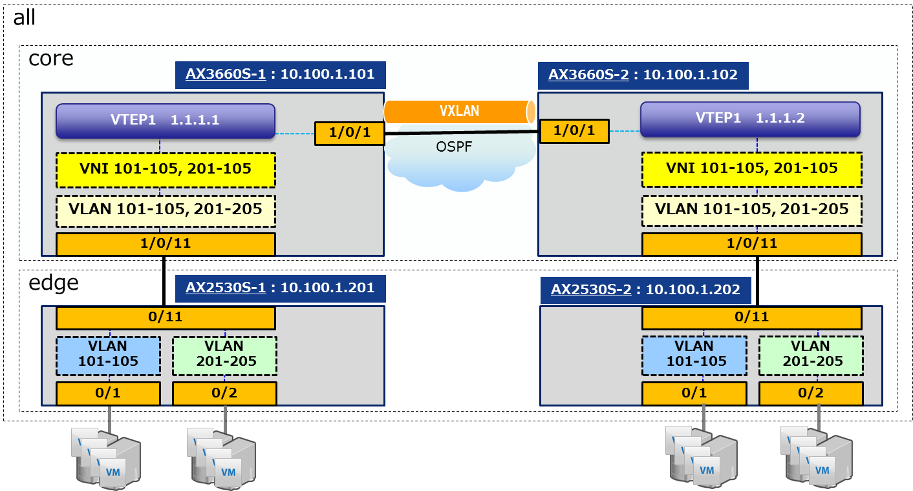

[→目次に戻る](./README.md)

# 4. 各ユースケースでのサンプルplaybook

## 4章概要
- [4.1 管理対象装置の構成とコンフィグレーション](#41-管理対象装置)
- [4.2 フィルタエントリの追加](/N18R001_Ansible_Guide_Chapter4.2.md)
- [4.3 VLANおよびVXLANの追加](/N18R001_Ansible_Guide_Chapter4.3.md)
- [4.4 ネットワーク装置の障害情報採取](/N18R001_Ansible_Guide_Chapter4.4.md)
- [4.5 ネットワーク装置のソフトウェアアップデート](/N18R001_Ansible_Guide_Chapter4.5.md)
- [4.6 NTPサーバ追加,移設にともなうネットワーク装置の設定](/N18R001_Ansible_Guide_Chapter4.6.md)

## 4.1 管理対象装置の構成とコンフィグレーション

### 4.1.1 構成

4.2章,4.3章,4.4章,4.6章で使用する管理対象装置の構成図、装置名称、inventoryファイルを以下に示します。4.5章はスタック構成で別構成となります。

**(1) 構成図**

**図 4.1 1  構成図（VLANおよびVXLANの初期状態）**

**図 4.1 2  構成図（アクセスリストの初期状態）**

**(2) 装置名称**

**表 4.1 1 装置名称**

|    inventory  |   |  管理対象装置  |  |
| :--------: | :----------: | :-------: | :-------: |
| inventory_groups | inventory_hostname |    ホスト名    |    モデル名    |
| core |  10.100.1.101   |  AX3660S-1   | AX3660S-48T4XW |
| core |  10.100.1.102   |  AX3660S-2   | AX3660S-48T4XW |
| edge |  10.100.1.201   |  AX2530S-1   |  AX2530S-24T   |
| edge |  10.100.1.202   |  AX2530S-2   |  AX2530S-24T   |

**(3) inventoryファイル**
~~~yaml
[all:children]
core
edge

[core]
10.100.1.101
10.100.1.102

[edge]
10.100.1.201
10.100.1.202
~~~

### 4.1.2 各装置のコンフィグレーション

管理対象装置のコンフィグレーションファイルを以下に示します。これは、playbook実行前のベースとなるコンフィグレーションファイルです。

**表 4.1 2 コンフィグレーションファイル**

|	スイッチ種  |管理対象装置名	|ファイル名	|
| :------: | :------: | :------: |
|コアスイッチ	|AX3660S-1	|[core_sw-1_config.txt](/config/core_sw-1_config.txt) |
|コアスイッチ |AX3660S-2    |[core_sw-2_config.txt](/config/core_sw-2_config.txt) |
|エッジスイッチ |AX2530S-1	|[edge_sw-1_config.txt](/config/edge_sw-1_config.txt) |
|エッジスイッチ |AX2530S-2  |[edge_sw-2_config.txt](/config/edge_sw-2_config.txt) |

[→4.2 フィルタエントリの追加](/N18R001_Ansible_Guide_Chapter4.2.md)  
[→目次に戻る](./README.md)
