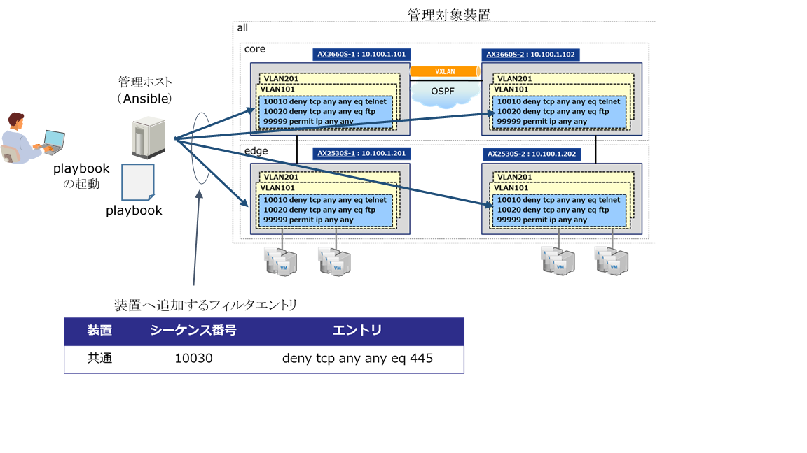

[→目次に戻る](./README.md)

## 4.2 フィルタエントリの追加

### 4.2.1 想定シナリオ

#### 4.2.1.1 概要

新種マルウェアや脆弱性によるセキュリティ被害がITシステム全体へ拡大することを防ぐために、複数のネットワーク装置に対し特定の通信を止めるためのパケットフィルタを設定するユースケースです。既に設定されているパケットフィルタを上書きすることがないよう確認しながら新たにフィルタエントリを追加するplaybookの例を示します。なお、本来であれば上記背景でのパケットフィルタは通信が発生するVLANすべてに設定すべきですが、簡単のためパケットフィルタを設定するVLANは2つのみとしています。

**図 4.2-1 フィルタエントリ追加の概要**

#### 4.2.1.2 playbook実行時の動作

playbook実行時の動作シナリオをplaybookを構成するタスク単位で示します。playbook実行対象は管理対象装置すべてです。

- 設定されているフィルタの確認  
1. 装置の運用中のコンフィグレーション(running-config)を取得する

2. 取得したコンフィグレーションから、アクセスリストのコンフィグレーションのみをタスク内で扱いやすい形式で抽出する  

3. 2で抽出したアクセスリスト情報を元に、追加するフィルタエントリのシーケンス番号と同じシーケンス番号のフィルタエントリが設定されているかをチェックする。設定されていた場合、当該フィルタエントリのフロー検出条件が追加フィルタエントリのフロー検出条件と同一かをチェックする。

4. 同一である場合、追加するフィルタエントリが既に設定されているが、目的との矛盾はないため、以降のタスクを実行する。同一でない場合、何らかの理由により別の目的でフィルタを設定しているため、上書きすることがないように以降のタスクを実行しない。
- コンフィグレーションの変更  
5. すべてのアクセスリストにフィルタエントリを追加する

### 4.2.2  使用するモジュール、ディレクティブ、プラグイン

本playbook内で使用しているモジュール、ディレクティブ、プラグインを以下の表に示します。

|モジュール、ディレクティブ、プラグイン名 |   説明 |
|--------------------| -------------------|
| ax\_config  | 2.2.2章参照 |
| ax\_facts   | 2.2.3章参照 |
| with\_items | [3.3.1章参照](/N18R001_Ansible_Guide_Chapter3.md) |
| with\_subelements | 二重ループを行うためのディレクティブです |
| set\_fact   | [3.3.5章参照](/N18R001_Ansible_Guide_Chapter3.md) |
| assert      | [3.3.5章参照](/N18R001_Ansible_Guide_Chapter3.md) |
| when        | [3.3.2章参照](/N18R001_Ansible_Guide_Chapter3.md) |

### 4.2.3 ファイル・ディレクトリ構成

本playbookを実行させるためのファイル・ディレクトリ構成です。
[usecase01](/usecase01)に本playbookの実行に必要なファイル一式を提供しています。

~~~yaml
./usecase01   　　　　　　　　　　　　　　   # add_acl.ymlのカレントディレクトリ
|
|--group_vars                             # グループ変数用のディレクトリ
|  |--all.yml                             # グループ全体に適用される変数ファイル
|
|--hosts                                  # inventoryファイル
|
|--add_acl.yml                            # フィルタエントリ追加用のplaybook
|
|--template                               # textFSM用テンプレート用ディレクトリ
|  |--alaxala_acl_ipv4ex.template         # ansible_net_configをparseするためのテンプレート
~~~

### 4.2.4 group\_vars, host\_vars, playbook, template

#### 4.2.4.1 グループ変数 (group\_vars)

invetoryで定義したグループ全体に適用される変数です。（ファイル名： [all.yml](/usecase01/group_vars/all.yml)）

~~~yaml
# 認証情報の設定 ★ コネクション方法：network_cliを使用するための変数を定義
ansible_network_os: ax                   # AlaxalA装置を指定する場合は‘ax’を指定
ansible_user: ユーザ名                    # SSHで装置ログインするユーザ名
ansible_password: パスワード              # SSHで装置ログインする際のパスワード指定
ansible_become: yes                      # 特権モード(＊)で実行の場合は ‘yes’に指定
ansible_become_method: enable            # 特権モード(＊)移行コマンド ‘enable’を指定
ansible_become_pass: 特権ユーザパスワード  # 特権モード(＊)のパスワード指定

template: 'template/alaxala_acl_ipv4ex.template'  # コメント1
add_acl_seq: '10030'                              # コメント2
add_acl_entry: 'deny tcp any any eq 445'          # コメント3

# コメント1:　ansible_net_configから必要なアクセスリスト情報を取り出すためのtextFSMテンプレート
# コメント2:　追加するフィルタエントリのシーケンス番号
# コメント3:　追加するフィルタエントリの検出条件とアクション
~~~

※「特権モード」はAlaxalA装置の「装置管理者モード」と同義です。

#### 4.2.4.2  ホスト変数(host\_vars)

本playbookでは管理対象装置ごとに適用する変数はありません。

#### 4.2.4.3 playbook

装置に対して設定されているIPv4パケットフィルタ(ip access-list extended)に、既に設定されているフィルタエントリを上書きすることがないように確認しながらフィルタエントリを追加するplaybookです。

（ファイル名： [add\_acl.yml](/usecase01/add_acl.yml)）

~~~yaml
- hosts: all                          # 管理対象装置・グループの指定
  gather_facts: no                    # factsの自動収集を無効化
  connection: network_cli             # コネクション方法：network_cliを指定
  max_fail_percentage: 0              # failed発生時に全装置でplaybook実行を止める ※

  tasks:
    - name: gather facts config　　　 # (1)running-configを取得
      ax_facts:
        gather_subset:
          - "all"

    - name: parse running-config　    # (2)running-configをparseして、
      set_fact:                       # ACL情報をacl_config変数に格納
        acl_config: '{{ ansible_net_config | parse_cli_textfsm( template ) }}'

    - name: check ACL config　　     # (3)既に設定済みフィルタエントリと追加する
      assert:                        # フィルタエントリで重複がないかを確認
        that:
          - "'{{ add_acl_seq }} {{ add_acl_entry }}'
                 ==  '{{ item.1 }}'"                 # 検出条件・アクション内容重複確認
      when: item.1 is match("^” + add_acl_seq + ” ")  # 上記重複確認はシーケンス番号が一致した場合
      with_subelements:                              # with_subelementsで二重ループ
        - "{{ acl_config }}"
        - AclEntry

    - name: add ACL config　　                       #(4)追加するフィルタエントリを投入
      ax_config:
        lines:
          - "{{ add_acl_seq }} {{ add_acl_entry }}"
        parents: "ip access-list extended {{ item.AclName }}"
        save_when: modified
      with_items: "{{ acl_config }}"
~~~
※「max\_fail\_percentage」は、taskの操作対象ホストのうちfailedになった割合が、この設定値%を超えていた場合には次の処理に移らないようにします。'0'　を指定した場合は、1台でもfailedが発生するとその時点で、playbookの実行を止めます。本ガイドの4章で紹介する以降のplaybookは「max\_fail\_percentage: 0」を指定します。

#### 4.2.4.4  template

**(1) running-config(ansible\_net\_config)をparseするためのtemplate**
（ファイル名： [alaxala\_acl\_ipv4ex.template](/usecase01/template/alaxala_acl_ipv4ex.template)）

running-configの表示結果のうちアクセスリストのコンフィグレーション部分をタスク内で扱いやすい形式にparseするためのテンプレートです。

~~~yaml
Value AclName (\S+)
Value Required Kind (ip access-list extended)
Value List AclEntry (\d+ (permit|deny) [\S\s\w]+[\S\w]+)

Start
  ^! -> Continue.Record
  ^${Kind} ${AclName}
  ^\s\s${AclEntry}
~~~
running-configのフィルタエントリ部分抜粋
~~~yaml
!
ip access-list extended VLAN0101-in
  10010 deny tcp any any eq telnet
  10020 deny tcp any any eq ftp
  99999 permit ip any any
!
ip access-list extended VLAN0201-in
  10010 deny tcp any any eq telnet
  10020 deny tcp any any eq ftp
  99999 permit ip any any
!
~~~
parseしてacl\_config変数に格納した結果
~~~yaml
"acl_config": [
    {
        "AclEntry": [
            "10010 deny tcp any any eq telnet ",
            "10020 deny tcp any any eq ftp ",
            "99999 permit ip any any "
        ],
        "AclName": "VLAN0101-in",
        "Kind": "ip access-list extended"
    },
    {
        "AclEntry": [
            "10010 deny tcp any any eq telnet ",
            "10020 deny tcp any any eq ftp ",
            "99999 permit ip any any "
        ],
        "AclName": "VLAN0201-in",
        "Kind": "ip access-list extended"
    }
]
~~~

### 4.2.5 実行例

**(1) 実行結果**
~~~yaml
[alaxala@localhost usecase01]$ ansible-playbook -i hosts add_acl.yml

PLAY [all] *****************************************************************************************************************************************

TASK [gather facts config] *************************************************************************************************************************
ok: [10.100.1.101]
ok: [10.100.1.102]
ok: [10.100.1.201]
ok: [10.100.1.202]

TASK [parse running-config] ************************************************************************************************************************
ok: [10.100.1.101]
ok: [10.100.1.102]
ok: [10.100.1.201]
ok: [10.100.1.202]

TASK [check ACL config] ****************************************************************************************************************************
skipping: [10.100.1.101] => (item=[{'AclName': u'VLAN0101-in', 'Kind': u'ip access-list extended'}, u'10010 deny tcp any any eq telnet'])
skipping: [10.100.1.101] => (item=[{'AclName': u'VLAN0101-in', 'Kind': u'ip access-list extended'}, u'10020 deny tcp any any eq ftp'])
skipping: [10.100.1.102] => (item=[{'AclName': u'VLAN0101-in', 'Kind': u'ip access-list extended'}, u'10010 deny tcp any any eq telnet'])
skipping: [10.100.1.101] => (item=[{'AclName': u'VLAN0101-in', 'Kind': u'ip access-list extended'}, u'99999 permit ip any any'])
skipping: [10.100.1.101] => (item=[{'AclName': u'VLAN0201-in', 'Kind': u'ip access-list extended'}, u'10010 deny tcp any any eq telnet'])
skipping: [10.100.1.101] => (item=[{'AclName': u'VLAN0201-in', 'Kind': u'ip access-list extended'}, u'10020 deny tcp any any eq ftp'])
skipping: [10.100.1.101] => (item=[{'AclName': u'VLAN0201-in', 'Kind': u'ip access-list extended'}, u'99999 permit ip any any'])
skipping: [10.100.1.201] => (item=[{'AclName': u'VLAN0101-in', 'Kind': u'ip access-list extended'}, u'10010 deny tcp any any eq telnet'])
skipping: [10.100.1.102] => (item=[{'AclName': u'VLAN0101-in', 'Kind': u'ip access-list extended'}, u'10020 deny tcp any any eq ftp'])
skipping: [10.100.1.102] => (item=[{'AclName': u'VLAN0101-in', 'Kind': u'ip access-list extended'}, u'99999 permit ip any any'])
skipping: [10.100.1.102] => (item=[{'AclName': u'VLAN0201-in', 'Kind': u'ip access-list extended'}, u'10010 deny tcp any any eq telnet'])
skipping: [10.100.1.102] => (item=[{'AclName': u'VLAN0201-in', 'Kind': u'ip access-list extended'}, u'10020 deny tcp any any eq ftp'])
skipping: [10.100.1.102] => (item=[{'AclName': u'VLAN0201-in', 'Kind': u'ip access-list extended'}, u'99999 permit ip any any'])
skipping: [10.100.1.201] => (item=[{'AclName': u'VLAN0101-in', 'Kind': u'ip access-list extended'}, u'10020 deny tcp any any eq ftp'])
skipping: [10.100.1.201] => (item=[{'AclName': u'VLAN0101-in', 'Kind': u'ip access-list extended'}, u'99999 permit ip any any'])
skipping: [10.100.1.201] => (item=[{'AclName': u'VLAN0201-in', 'Kind': u'ip access-list extended'}, u'10010 deny tcp any any eq telnet'])
skipping: [10.100.1.201] => (item=[{'AclName': u'VLAN0201-in', 'Kind': u'ip access-list extended'}, u'10020 deny tcp any any eq ftp'])
skipping: [10.100.1.201] => (item=[{'AclName': u'VLAN0201-in', 'Kind': u'ip access-list extended'}, u'99999 permit ip any any'])
skipping: [10.100.1.202] => (item=[{'AclName': u'VLAN0101-in', 'Kind': u'ip access-list extended'}, u'10010 deny tcp any any eq telnet'])
skipping: [10.100.1.202] => (item=[{'AclName': u'VLAN0101-in', 'Kind': u'ip access-list extended'}, u'10020 deny tcp any any eq ftp'])
skipping: [10.100.1.202] => (item=[{'AclName': u'VLAN0101-in', 'Kind': u'ip access-list extended'}, u'99999 permit ip any any'])
skipping: [10.100.1.202] => (item=[{'AclName': u'VLAN0201-in', 'Kind': u'ip access-list extended'}, u'10010 deny tcp any any eq telnet'])
skipping: [10.100.1.202] => (item=[{'AclName': u'VLAN0201-in', 'Kind': u'ip access-list extended'}, u'10020 deny tcp any any eq ftp'])
skipping: [10.100.1.202] => (item=[{'AclName': u'VLAN0201-in', 'Kind': u'ip access-list extended'}, u'99999 permit ip any any'])

TASK [add ACL config] ******************************************************************************************************************************
changed: [10.100.1.101] => (item={'AclEntry': [u'10010 deny tcp any any eq telnet', u'10020 deny tcp any any eq ftp', u'99999 permit ip any any'], 'AclName': u'VLAN0101-in', 'Kind': u'ip access-list extended'})
changed: [10.100.1.102] => (item={'AclEntry': [u'10010 deny tcp any any eq telnet', u'10020 deny tcp any any eq ftp', u'99999 permit ip any any'], 'AclName': u'VLAN0101-in', 'Kind': u'ip access-list extended'})
changed: [10.100.1.101] => (item={'AclEntry': [u'10010 deny tcp any any eq telnet', u'10020 deny tcp any any eq ftp', u'99999 permit ip any any'], 'AclName': u'VLAN0201-in', 'Kind': u'ip access-list extended'})
changed: [10.100.1.102] => (item={'AclEntry': [u'10010 deny tcp any any eq telnet', u'10020 deny tcp any any eq ftp', u'99999 permit ip any any'], 'AclName': u'VLAN0201-in', 'Kind': u'ip access-list extended'})
changed: [10.100.1.201] => (item={'AclEntry': [u'10010 deny tcp any any eq telnet', u'10020 deny tcp any any eq ftp', u'99999 permit ip any any'], 'AclName': u'VLAN0101-in', 'Kind': u'ip access-list extended'})
changed: [10.100.1.202] => (item={'AclEntry': [u'10010 deny tcp any any eq telnet', u'10020 deny tcp any any eq ftp', u'99999 permit ip any any'], 'AclName': u'VLAN0101-in', 'Kind': u'ip access-list extended'})
changed: [10.100.1.201] => (item={'AclEntry': [u'10010 deny tcp any any eq telnet', u'10020 deny tcp any any eq ftp', u'99999 permit ip any any'], 'AclName': u'VLAN0201-in', 'Kind': u'ip access-list extended'})
changed: [10.100.1.202] => (item={'AclEntry': [u'10010 deny tcp any any eq telnet', u'10020 deny tcp any any eq ftp', u'99999 permit ip any any'], 'AclName': u'VLAN0201-in', 'Kind': u'ip access-list extended'})

PLAY RECAP *****************************************************************************************************************************************
10.100.1.101               : ok=3    changed=1    unreachable=0    failed=0    skipped=1    rescued=0    ignored=0
10.100.1.102               : ok=3    changed=1    unreachable=0    failed=0    skipped=1    rescued=0    ignored=0
10.100.1.201               : ok=3    changed=1    unreachable=0    failed=0    skipped=1    rescued=0    ignored=0
10.100.1.202               : ok=3    changed=1    unreachable=0    failed=0    skipped=1    rescued=0    ignored=0
~~~

**(2) 管理対象装置の操作ログ（AX3660S-1の例）**

本playbookを実行したときの管理対象装置側の操作ログの結果を以下に示します。
~~~yaml
KEY 09/24 11:52:15 alaxala(ttyp0):AX3660S-1(config)# end
KEY 09/24 11:52:14 alaxala(ttyp0):!AX3660S-1(config)# save
KEY 09/24 11:52:14 alaxala(ttyp0):!AX3660S-1# configure terminal
KEY 09/24 11:52:14 alaxala(ttyp0):!AX3660S-1# show startup-config
KEY 09/24 11:52:14 alaxala(ttyp0):!AX3660S-1# show running-config
KEY 09/24 11:52:13 alaxala(ttyp0):y
KEY 09/24 11:52:13 alaxala(ttyp0):!AX3660S-1(config-ext-nacl)# end
KEY 09/24 11:52:13 alaxala(ttyp0):AX3660S-1(config-ext-nacl)# 10030 deny tcp any any eq 445
KEY 09/24 11:52:13 alaxala(ttyp0):AX3660S-1(config)# ip access-list extended VLAN0201-in
KEY 09/24 11:52:13 alaxala(ttyp0):AX3660S-1# configure terminal
KEY 09/24 11:52:13 alaxala(ttyp0):AX3660S-1# show running-config
KEY 09/24 11:52:12 alaxala(ttyp0):AX3660S-1# show version
KEY 09/24 11:52:12 alaxala(ttyp0):AX3660S-1# show system
KEY 09/24 11:52:12 alaxala(ttyp0):AX3660S-1# show version
KEY 09/24 11:52:12 alaxala(ttyp0):AX3660S-1(config)# end
KEY 09/24 11:52:11 alaxala(ttyp0):!AX3660S-1(config)# save
KEY 09/24 11:52:11 alaxala(ttyp0):!AX3660S-1# configure terminal
KEY 09/24 11:52:11 alaxala(ttyp0):!AX3660S-1# show startup-config
KEY 09/24 11:52:11 alaxala(ttyp0):!AX3660S-1# show running-config
KEY 09/24 11:52:11 alaxala(ttyp0):y
KEY 09/24 11:52:11 alaxala(ttyp0):!AX3660S-1(config-ext-nacl)# end
KEY 09/24 11:52:10 alaxala(ttyp0):AX3660S-1(config-ext-nacl)# 10030 deny tcp any any eq 445
KEY 09/24 11:52:10 alaxala(ttyp0):AX3660S-1(config)# ip access-list extended VLAN0101-in
KEY 09/24 11:52:10 alaxala(ttyp0):AX3660S-1# configure terminal
KEY 09/24 11:52:10 alaxala(ttyp0):AX3660S-1# show running-config
KEY 09/24 11:52:10 alaxala(ttyp0):AX3660S-1# show version
KEY 09/24 11:52:09 alaxala(ttyp0):AX3660S-1# show system
KEY 09/24 11:52:09 alaxala(ttyp0):AX3660S-1# show version
KEY 09/24 11:51:54 alaxala(ttyp0):AX3660S-1# show running-config
KEY 09/24 11:51:54 alaxala(ttyp0):AX3660S-1# show port
KEY 09/24 11:51:54 alaxala(ttyp0):AX3660S-1# show memory
KEY 09/24 11:51:54 alaxala(ttyp0):AX3660S-1# show version
KEY 09/24 11:51:53 alaxala(ttyp0):AX3660S-1# show system
KEY 09/24 11:51:53 alaxala(ttyp0):AX3660S-1# show version
KEY 09/24 11:51:53 alaxala(ttyp0):AX3660S-1> enable
KEY 09/24 11:51:53 alaxala(ttyp0):AX3660S-1> set logging console disable E9
KEY 09/24 11:51:52 alaxala(ttyp0):AX3660S-1> show version
KEY 09/24 11:51:52 alaxala(ttyp0):AX3660S-1> set terminal pager disable
~~~

**(3) 本playbookの実行時間**

約1分（全管理装置に対する実行時間）

(注) 弊社環境にて、playbook起動から終了までを計測した時間です。

[→4.3 VLANおよびVXLANの追加](/N18R001_Ansible_Guide_Chapter4.3.md)  
[→目次に戻る](./README.md)
