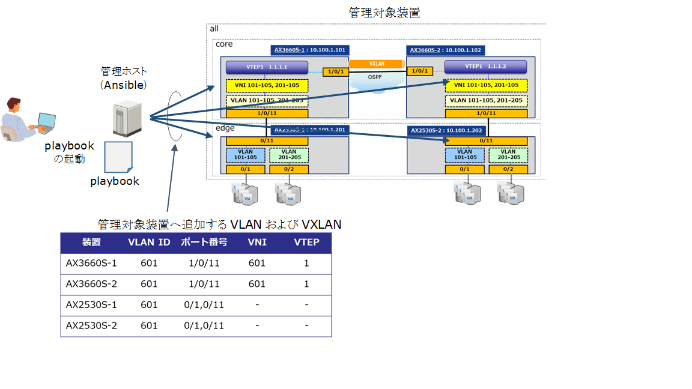

[→目次に戻る](/README.md)

## 4.3  VLANおよびVXLANの追加

### 4.3.1  想定シナリオ

#### 4.3.1.1  概要

マルチテナントの仮想サーバー基盤において、新規テナントを追加する際にVLANやVXLAN等のネットワークリソースを複数の機器にまとめて設定するユースケースです。誤ってループ等が発生することを防ぐために、新たに追加するVLANおよびVXLANがシステム上に存在しないことを確認した上で指定された装置に対してまとめて設定するplaybookの例を示します。

**図 4.3 1  VLANおよびVXLAN追加の概要**

#### 4.3.1.2 playbook実行時の動作

- 作業前の処理  
 1. 管理ホスト上に作業結果を格納するディレクトリを作成

 2. 管理対象装置から装置情報(筐体情報、インタフェース情報、コンフィグレーション、メモリ情報)を収集する

 3. 収集したコンフィグレーション（running-config）を管理ホストに格納する

- 装置状態の確認

 4. 追加するVLANが全管理対象装置上に存在しないことを確認する。既に存在する場合は以降のタスクを実行しない

 5. 追加するVNIがcoreグループに属する管理対象装置上に存在しないことを確認する。既に存在する場合は以降のタスクを実行しない
- 作業

 6. 全管理対象装置に対して、VLANの追加およびポートへの割り当てを行う

 7. coreグループに属する管理対象装置に対して、VNIの追加およびVTEPへの割り当てを行う

- 作業後の確認

 8. 管理対象装置から再び装置情報を収集する

 9. 収集したコンフィグレーション（running-config）を管理ホストに格納する

 10. 作業前のコンフィグレーションと作業後のコンフィグレーションを比較し差分を管理ホストに格納する

### 4.3.2 使用するモジュール、ディレクティブ、プラグイン

本playbook内で使用しているモジュール、ディレクティブ、プラグインを以下の表に示します。

|モジュール、ディレクティブ、プラグイン名	|説明|
|--------------------| -------------------|
|ax_command	|2.2.1章参照|
|ax_facts	|2.2.3章参照|
|with_items	|[3.3.1章参照](/N18R001_Ansible_Guide_Chapter3.md)|
|when	|[3.3.2章参照](/N18R001_Ansible_Guide_Chapter3.md)|
|set_fact	|[3.3.5章参照](/N18R001_Ansible_Guide_Chapter3.md)|
|textFSM	|[3.3.4章参照](/N18R001_Ansible_Guide_Chapter3.md)|
|assert	|[3.3.5章参照](/N18R001_Ansible_Guide_Chapter3.md)|
|copy	|[3.3.6章参照](/N18R001_Ansible_Guide_Chapter3.md)|
|include	|別ファイルに記載したタスクを引用します。|

### 4.3.3 ファイル・ディレクトリ構成

~~~yaml
./usecase02                                   #　add_tenant.ymlのカレントディレクトリ
|
|--group_vars                             	#　グループ変数用のディレクトリ
|  |--all.yml                                 #　グループ全体に適用される変数ファイル
|
|--host_vars                              	#　ホスト変数用のディレクトリ
|  |--10.100.1.101.yml	                    #　10.100.1.101に適用される変数ファイル
|  |--10.100.1.102.yml	                    #　10.100.1.102に適用される変数ファイル
|  |--10.100.1.201.yml	                    #　10.100.1.201に適用される変数ファイル
|  |--10.100.1.202.yml	                    #　10.100.1.202に適用される変数ファイル
|
|--hosts		                              #　inventoryファイル
|
|--add_tenant.yml                      	   #　VLANおよびVXLANを追加するplaybook
|
|--task_lib                                   #　includeされるタスク用のディレクトリ
|  |--check_vlan_absent.yml                   #　vlanが存在しないことを確認するタスク
|  |--check_vni_absent.yml                    #　vniが存在しないことを確認するタスク
|  |--add_vlan.yml                    	    #　vlanを追加するタスク
|  |--add_vni.yml                             #　vniを追加するタスク
|
|--template                                   #　textFSM用テンプレート用ディレクトリ
  |--alaxala_show_vlan_list.template   	   #　show vlan listをparseするためのテンプレート
  |--alaxala_show_vxlan_vni.template          #　show vxlan vniをparseするためのテンプレート
~~~

本playbookを実行させるためのファイル・ディレクトリ構成です。
[usecase02](/usecase02)に本playbookの実行に必要なファイル一式を提供しています。

### 4.3.4 group\_vars , host\_vars ,playbook, template

#### 4.3.4.1 グループ変数 (group\_vars)

inventoryで定義したグループ全体に適用される変数です。（ファイル名：[all.yml](/usecase02/group_vars/all.yml)）

~~~yaml
# 認証情報の設定 ★ コネクション方法：network_cliを使用するための変数を定義
ansible_network_os: ax                   # AlaxalA装置を指定する場合は‘ax’を指定
ansible_user: ユーザ名                    # SSHで装置ログインするユーザ名
ansible_password: パスワード              # SSHで装置ログインする際のパスワード指定
ansible_become: yes                      # 特権モードで実行の場合は ‘yes’に指定
ansible_become_method: enable            # 特権モード移行コマンド ‘enable’を指定
ansible_become_pass: 特権ユーザパスワード  # 特権モードのパスワード指定

template_show_vlan_list: 'template/alaxala_show_vlan_list.template'  # コメント1
template_show_vxlan_vni: 'template/alaxala_show_vxlan_vni.template'  # コメント2

　　　# コメント1:　show vlan listの結果から必要な変数を取り出すためのテンプレート
　　　# コメント2:　show vxlan vniの結果から必要な変数を取り出すためのテンプレート
~~~

#### 4.3.4.2 ホスト変数　(host\_vars)

inventoryで定義した管理対象装置ごとに適用される変数です。

**(1) 10.100.1.101に適用される変数**　（ファイル名：[10.100.1.101.yml](/usecase02/host_vars/10.100.1.101.yml)）
~~~yaml
vid: '601'      # VLAN ID = 601
port: '1/0/11'  # ポート番号 = 1/0/11
vni: '601'      # VNI番号 = 601
vtep: '1'       # VTEP番号 = 1
~~~

**(2) 10.100.1.102に適用される変数**　（ファイル名：[10.100.1.102.yml](/usecase02/host_vars/10.100.1.102.yml)）
~~~yaml
vid: '601'      # VLAN ID = 601
port: '1/0/11'  # ポート番号 = 1/0/11
vni: '601'      # VNI番号 = 601
vtep: '1'       # VTEP番号 = 1
~~~

**(3) 10.100.1.201に適用される変数**　（ファイル名：[10.100.1.201.yml](/usecase02/host_vars/10.100.1.201.yml)）
~~~yaml
vid: '601'      # VLAN ID = 601
port:
  -  '0/1'      # ポート番号 = 0/1
  -  '0/11'     # ポート番号 = 0/11
~~~

**(4) 10.100.1.202に適用される変数**　（ファイル名：[10.100.1.202.yml](/usecase02/host_vars/10.100.1.202.yml)）

~~~yaml
vid: '601'      # VLAN ID = 601
port:
  -  '0/1'      # ポート番号 = 0/1
  -  '0/11'     # ポート番号 = 0/11
~~~

#### 4.3.4.3 playbook

**(1)  VLANおよびVXLANを追加するplaybook**　（ファイル名：[add\_tenant.yml](/usecase02/add_tenant.yml)）

装置に対して、ホスト変数で定義されたVLANとVNIを設定するplaybookです。全体の処理の視認性を高めるため、各処理を行うタスクのファイルを分けています。
~~~yaml
- hosts: all
  gather_facts: no
  connection: network_cli
  max_fail_percentage: 0　　　　　　

  tasks:             
    - name: generate a directory to store result
      file: path="./result/"
            state=directory

    - name: gather ax facts "all"
      ax_facts:
        gather_subset:
          - "all"

    - name: copy running-config into rconf_<hostname>_before.cnf
      copy:
        content: "{{ ansible_net_config}}"
        dest: "./result/rconf_{{ ansible_net_hostname }}_before.cnf"

    - name: include "check_vlan_absent.yml" for group "all"
      include_tasks: task_lib/check_vlan_absent.yml  

    - name: include "check_vni_absent.yml" for group "core"
      include_tasks: task_lib/check_vni_absent.yml  
      when: "inventory_hostname in groups['core']"    

    - name: include "add_vlan.yml" for group "all"
      include_tasks: task_lib/add_vlan.yml  

    - name: include "add_vni.yml " for group "core"
      include_tasks: task_lib/add_vni.yml
      when: "inventory_hostname in groups['core']"            

    - name: gather ax facts "all"
      ax_facts:
        gather_subset:
          - "all"

    - name: copy running-config into rconf_<hostname>_after.cnf
      copy:
        content: "{{ ansible_net_config}}"
        dest: "./result/rconf_{{ ansible_net_hostname }}_after.cnf"

    - name: get difference between before and after for group "all"
      shell: "diff -u ./result/rconf_{{ ansible_net_hostname }}_before.cnf
                      ./result/rconf_{{ ansible_net_hostname }}_after.cnf
                      > ./result/rconf_{{ ansible_net_hostname }}_diff.txt"
      register: result_diff
      failed_when: result_diff.rc not in [0, 1]
~~~

#### 4.3.4.4 各処理を行うタスク

add\_tenant.ymlにincludeされるタスクです。

**(1) vlanが存在しないことを確認するタスク**　（ファイル名：[check\_vlan\_absent.yml](/usecase02/task_lib/check_vlan_absent.yml)）
~~~yaml
    - name: execute  "show vlan list"
      ax_command:
        commands:
          - show vlan list
      register: result_show_vlan_list

    - name: parse result_show_vlan_list
      set_fact:
        parse_show_vlan_list: "{{ result_show_vlan_list.stdout[0] | parse_cli_textfsm( template_show_vlan_list ) }}"      

    - name: check if vlan absents on target nodes
      assert:
        that:
           - "'{{ vid }}' not in (parse_show_vlan_list | map(attribute='VLANID') | list)"
~~~

**(2) vniが存在しないことを確認するタスク** （ファイル名：[check\_vni\_absent.yml](/usecase02/task_lib/check_vni_absent.yml)）
~~~yaml
    - name: execute  "show vxlan vni"  
      ax_command:
        commands:
           - show vxlan vni
      register: result_show_vxlan_vni

    - name: parse  result_show_vxlan_vni
      set_fact:
        parse_show_vxlan_vni: "{{ result_show_vxlan_vni.stdout[0] | parse_cli_textfsm( template_show_vxlan_vni ) }}"      

    - name: check if vni absents on target nodes
      assert:
        that:
           - "'{{ vni }}' not in (parse_show_vxlan_vni | map(attribute='VNI') | list)"
~~~

**(3) VLANの追加およびポートへの割り当てを行うタスク**　（ファイル名：[add\_vlan.yml](/usecase02/task_lib/add_vlan.yml)）
~~~yaml
 - name: configure "vlan"
      ax_config:
        lines:
           - vlan {{ vid }}
        save_when: modified

    - name: configure "switchport trunk allowed vlan add in interface "
      ax_config:
        lines:
           - switchport trunk allowed vlan add {{ vid }}
        parents: "interface {{ ansible_net_interfaces[ item ].linespeed }} {{ item }}"
        save_when: modified
      with_items: "{{ port }}"
~~~

**(4) VNIの追加およびVTEPへの割り当てを行うタスク**　（ファイル名：[add\_vni.yml](/usecase02/task_lib/add_vni.yml)）
~~~yaml
 - name: configuer "vxlan-vni  in vlan"
      ax_config:
        lines:
            - "vxlan-vni {{ vni }}"
        parents: "vlan {{ vid }}"
        save_when: modified

    - name: configuer "member vni add in interface vxlan"
      ax_config:
        lines:
           - "member vni add {{ vni }}"
        parents: "interface vxlan {{ vtep }}"
        save_when: modified  
~~~

#### 4.3.4.5 template

**(1) show vlan listの結果をparseするためのtemplate**
（ファイル名：[alaxala\_show\_vlan\_list.template](/usecase02/template/alaxala_show_vlan_list.template)）
~~~yaml
Value VLANID (\d+)
Value STATUS (\S+)
Value FWD (\d+)
Value UP (\d+)
Value CFG (\d+)
Value NAME (\S+)
Value TYPE (\S+)
Value PROTC (\S+)

Start  ^\s+${VLANID}\s+${STATUS}\s+${FWD}/\s+${UP}/\s+${CFG}\s+${NAME}\s+${TYPE}\s+${PROTC}\s+[\S\s\S+\s+] -> Record
~~~

show vlan listの実行結果（AX3660S-1の例）
~~~yaml
AX3660S-1# show vlan list
Date 2019/09/26 18:14:44 JST
VLAN counts:14
Number of VLAN ports:62
ID   Status  Fwd/Up /Cfg Name             Type  Protocol         Ext.  IP
   1 Down      0/  0/ 48 VLAN0001         Port  -                - - - -
  10 Up        1/  1/  1 VLAN0010         Port  -                - - - 4
 100 Down      0/  0/  2 VLAN0100         Port  -                - - - -
 101 Disable   0/  1/  1 VLAN0101         Port  -                - - - -
 102 Disable   0/  1/  1 VLAN0102         Port  -                - - - -
 103 Disable   0/  1/  1 VLAN0103         Port  -                - - - -
 104 Disable   0/  1/  1 VLAN0104         Port  -                - - - -
 105 Disable   0/  1/  1 VLAN0105         Port  -                - - - -
 201 Disable   0/  1/  1 VLAN0201         Port  -                - - - -
 202 Disable   0/  1/  1 VLAN0202         Port  -                - - - -
 203 Disable   0/  1/  1 VLAN0203         Port  -                - - - -
 204 Disable   0/  1/  1 VLAN0204         Port  -                - - - -
 205 Disable   0/  1/  1 VLAN0205         Port  -                - - - -
 601 Disable   0/  1/  1 VLAN0601         Port  -                - - - -
     AXRP (C:Control-VLAN)
     GSRP GSRP ID:VLAN Group ID(M:Master/B:Backup)
     S:IGMP/MLD snooping  T:Tag Translation
     4:IPv4 address configured  6:IPv6 address configured
~~~

TextFSMでparseした結果（AX3660S-1のVLAN ID=1の例）
~~~yaml
 "result_parse": {
        "ansible_facts": {
            "parse_show_vlan_list": [
                {
                    "CFG": "48",
                    "FWD": "0",
                    "NAME": "VLAN0001",
                    "PROTC": "-",
                    "STATUS": "Down",
                    "TYPE": "Port",
                    "UP": "0",
                    "VLANID": "1"
~~~

(2) **show vxlan vniの結果をparseするtemplate**
（ファイル名：[alaxala\_show\_vxlan\_vni.template](/usecase02/template/alaxala_show_vxlan_vni.template)）
~~~yaml
Value Filldown VTEPID (\d+)
Value Required VNI (\d+)
Value Required STATUS (enable|disable)
Value LEARNING (\S+)

Start
  ^VTEP ID: ${VTEPID}
  ^\s+VNI: ${VNI}\s+Status: ${STATUS}
  ^\s+Learning: ${LEARNING} -> Record
~~~

show vxlan vniの実行結果（AX3660S-1の例）
~~~yaml
!AX3660S-1# show vxlan vni
Date 2018/04/21 17:30:48 JST
VTEP ID: 1
  VNI: 101       Status: enable
                 Learning: On
    VLAN: 101   Port: 1/0/11
  VNI: 102       Status: enable
                 Learning: On
    VLAN: 102   Port: 1/0/11
  VNI: 103       Status: enable
                 Learning: On
~~~

TextFSMでparseした結果（AX3660S-1のVTEP=1,VNI＝101の例）
~~~yaml
 "result_parse": {
        "ansible_facts": {
            "parse_show_vxlan_vni": [
                {
                    "LEARNING": "On",
                    "PORT": "1/0/11",
                    "STATUS": "enable",
                    "VLAN": "101",
                    "VNI": "101",
                    "VTEPID": "1"
                },
~~~

### 4.3.5 実行例

**(1) 実行結果**
~~~yaml
[alaxala@localhost usecase02]$ ansible-playbook -i hosts add_tenant.yml

PLAY [all] *****************************************************************************************************************************************************************************

TASK [generate a directory to store result] ********************************************************************************************************************************************
ok: [10.100.1.102]
changed: [10.100.1.101]
ok: [10.100.1.201]
ok: [10.100.1.202]

TASK [gather ax facts "all"] ***********************************************************************************************************************************************************
ok: [10.100.1.101]
ok: [10.100.1.102]
ok: [10.100.1.201]
ok: [10.100.1.202]

(途中省略)

TASK [check if vlan <vid> absents on target hosts] *************************************************************************************************************************************
ok: [10.100.1.101] => {
    "changed": false,
    "msg": "All assertions passed"
}
ok: [10.100.1.102] => {
    "changed": false,
    "msg": "All assertions passed"
}
ok: [10.100.1.201] => {
    "changed": false,
    "msg": "All assertions passed"
}
ok: [10.100.1.202] => {
    "changed": false,
    "msg": "All assertions passed"
}

（途中省略）

TASK [configure "switchport trunk allowed vlan add <vid> in <port> "] ******************************************************************************************************************
changed: [10.100.1.101] => (item=1/0/11)
changed: [10.100.1.102] => (item=1/0/11)
changed: [10.100.1.201] => (item=0/1)
changed: [10.100.1.202] => (item=0/1)
changed: [10.100.1.201] => (item=0/11)
changed: [10.100.1.202] => (item=0/2)
changed: [10.100.1.202] => (item=0/11)

（途中省略）

PLAY RECAP *****************************************************************************************************************************************************************************
10.100.1.101               : ok=21   changed=8    unreachable=0    failed=0    skipped=0    rescued=0    ignored=0
10.100.1.102               : ok=21   changed=7    unreachable=0    failed=0    skipped=0    rescued=0    ignored=0
10.100.1.201               : ok=13   changed=5    unreachable=0    failed=0    skipped=2    rescued=0    ignored=0
10.100.1.202               : ok=13   changed=5    unreachable=0    failed=0    skipped=2    rescued=0    ignored=0
~~~

**(2) 作業前と作業後running-configの差分の比較結果（AX3660S-1の例）**
（ファイル名：rconf\_AX3660S-1\_diff.tx）
~~~yaml
--- ./result/rconf_AX3660S-1_before.cnf 2019-09-24 17:08:03.252942285 +0900
+++ ./result/rconf_AX3660S-1_after.cnf  2019-09-24 17:08:44.529677069 +0900
@@ -1,4 +1,4 @@
-#Last modified by alaxala at Tue Sep 24 16:53:37 2019 with version 12.1.H
+#Last modified by alaxala at Tue Sep 24 17:06:42 2019 with version 12.1.H
 !
 hostname "AX3660S-1"
 clock timezone JST +9
@@ -44,6 +44,9 @@
 vlan 205
   vxlan-vni 205
 !
+vlan 601
+  vxlan-vni 601
+!
 vlan 1010
 !
 spanning-tree disable
@@ -90,7 +93,7 @@
 !
 interface gigabitethernet 1/0/11
   switchport mode trunk
-  switchport trunk allowed vlan 101-105,201-205
+  switchport trunk allowed vlan 101-105,201-205,601
 !
 interface gigabitethernet 1/0/12
   switchport mode access
@@ -232,7 +235,7 @@
 !
 interface vxlan 1
   source-interface loopback 0
-  member vni 101-105,201-205
+  member vni 101-105,201-205,601
   destination-ip 1.1.1.2
 !
 router ospf 1
~~~
**(3) 管理対象装置の操作ログ（AX3660S-1の例）**

本playbookを実行したときの管理対象装置側の操作ログの結果を以下に示します。

show loggingの結果
~~~yaml
KEY 09/26 18:08:54 alaxala(ttyp0):AX3660S-1# show running-config
KEY 09/26 18:08:53 alaxala(ttyp0):AX3660S-1# show port
KEY 09/26 18:08:53 alaxala(ttyp0):AX3660S-1# show memory
KEY 09/26 18:08:53 alaxala(ttyp0):AX3660S-1# show version
KEY 09/26 18:08:53 alaxala(ttyp0):AX3660S-1# show system
KEY 09/26 18:08:52 alaxala(ttyp0):AX3660S-1# show version
KEY 09/26 18:08:51 alaxala(ttyp0):AX3660S-1(config)# end
KEY 09/26 18:08:51 alaxala(ttyp0):!AX3660S-1(config)# save
KEY 09/26 18:08:50 alaxala(ttyp0):!AX3660S-1# configure terminal
KEY 09/26 18:08:50 alaxala(ttyp0):!AX3660S-1# show startup-config
KEY 09/26 18:08:50 alaxala(ttyp0):!AX3660S-1# show running-config
KEY 09/26 18:08:50 alaxala(ttyp0):y
KEY 09/26 18:08:50 alaxala(ttyp0):!AX3660S-1(config-if)# end
KEY 09/26 18:08:50 alaxala(ttyp0):AX3660S-1(config-if)# member vni add 601
KEY 09/26 18:08:50 alaxala(ttyp0):AX3660S-1(config)# interface vxlan 1
KEY 09/26 18:08:49 alaxala(ttyp0):AX3660S-1# configure terminal
KEY 09/26 18:08:49 alaxala(ttyp0):AX3660S-1# show running-config
KEY 09/26 18:08:49 alaxala(ttyp0):AX3660S-1# show version
KEY 09/26 18:08:49 alaxala(ttyp0):AX3660S-1# show system
KEY 09/26 18:08:49 alaxala(ttyp0):AX3660S-1# show version
KEY 09/26 18:08:48 alaxala(ttyp0):AX3660S-1(config)# end
KEY 09/26 18:08:47 alaxala(ttyp0):!AX3660S-1(config)# save
KEY 09/26 18:08:47 alaxala(ttyp0):!AX3660S-1# configure terminal
KEY 09/26 18:08:47 alaxala(ttyp0):!AX3660S-1# show startup-config
KEY 09/26 18:08:47 alaxala(ttyp0):!AX3660S-1# show running-config
KEY 09/26 18:08:47 alaxala(ttyp0):y
KEY 09/26 18:08:47 alaxala(ttyp0):!AX3660S-1(config-vlan)# end
EVT 09/26 18:08:47 01S E4 VLAN 25100002 0700:025900000000 VLAN (601) Status is Down.
KEY 09/26 18:08:46 alaxala(ttyp0):AX3660S-1(config-vlan)# vxlan-vni 601
KEY 09/26 18:08:46 alaxala(ttyp0):AX3660S-1(config)# vlan 601
KEY 09/26 18:08:46 alaxala(ttyp0):AX3660S-1# configure terminal
KEY 09/26 18:08:46 alaxala(ttyp0):AX3660S-1# show running-config
KEY 09/26 18:08:46 alaxala(ttyp0):AX3660S-1# show version
KEY 09/26 18:08:45 alaxala(ttyp0):AX3660S-1# show system
KEY 09/26 18:08:45 alaxala(ttyp0):AX3660S-1# show version
KEY 09/26 18:08:24 alaxala(ttyp0):AX3660S-1(config)# end
KEY 09/26 18:08:23 alaxala(ttyp0):!AX3660S-1(config)# save
KEY 09/26 18:08:23 alaxala(ttyp0):!AX3660S-1# configure terminal
KEY 09/26 18:08:23 alaxala(ttyp0):!AX3660S-1# show startup-config
KEY 09/26 18:08:23 alaxala(ttyp0):!AX3660S-1# show running-config
EVT 09/26 18:08:23 01S E4 VLAN 25100001 0700:025900000000 VLAN (601) Status is Up.
KEY 09/26 18:08:22 alaxala(ttyp0):y
KEY 09/26 18:08:22 alaxala(ttyp0):!AX3660S-1(config-if)# end
KEY 09/26 18:08:22 alaxala(ttyp0):AX3660S-1(config-if)# switchport trunk allowed vlan add 601
KEY 09/26 18:08:22 alaxala(ttyp0):AX3660S-1(config)# interface gigabitethernet 1/0/11
KEY 09/26 18:08:22 alaxala(ttyp0):AX3660S-1# configure terminal
KEY 09/26 18:08:22 alaxala(ttyp0):AX3660S-1# show running-config
KEY 09/26 18:08:21 alaxala(ttyp0):AX3660S-1# show version
KEY 09/26 18:08:21 alaxala(ttyp0):AX3660S-1# show system
KEY 09/26 18:08:21 alaxala(ttyp0):AX3660S-1# show version
KEY 09/26 18:08:15 alaxala(ttyp0):AX3660S-1(config)# end
KEY 09/26 18:08:14 alaxala(ttyp0):!AX3660S-1(config)# save
KEY 09/26 18:08:14 alaxala(ttyp0):!AX3660S-1# configure terminal
KEY 09/26 18:08:14 alaxala(ttyp0):!AX3660S-1# show startup-config
KEY 09/26 18:08:14 alaxala(ttyp0):!AX3660S-1# show running-config
KEY 09/26 18:08:13 alaxala(ttyp0):y
KEY 09/26 18:08:13 alaxala(ttyp0):!AX3660S-1(config-vlan)# end
KEY 09/26 18:08:13 alaxala(ttyp0):AX3660S-1(config)# vlan 601
KEY 09/26 18:08:13 alaxala(ttyp0):AX3660S-1# configure terminal
KEY 09/26 18:08:13 alaxala(ttyp0):AX3660S-1# show running-config
KEY 09/26 18:08:13 alaxala(ttyp0):AX3660S-1# show version
KEY 09/26 18:08:12 alaxala(ttyp0):AX3660S-1# show system
KEY 09/26 18:08:12 alaxala(ttyp0):AX3660S-1# show version
KEY 09/26 18:08:10 alaxala(ttyp0):AX3660S-1# show vxlan vni
KEY 09/26 18:08:09 alaxala(ttyp0):AX3660S-1# show system
KEY 09/26 18:08:09 alaxala(ttyp0):AX3660S-1# show version
KEY 09/26 18:08:04 alaxala(ttyp0):AX3660S-1# show vlan list
KEY 09/26 18:08:03 alaxala(ttyp0):AX3660S-1# show system
KEY 09/26 18:08:03 alaxala(ttyp0):AX3660S-1# show version
KEY 09/26 18:07:57 alaxala(ttyp0):AX3660S-1# show running-config
KEY 09/26 18:07:57 alaxala(ttyp0):AX3660S-1# show port
KEY 09/26 18:07:57 alaxala(ttyp0):AX3660S-1# show memory
KEY 09/26 18:07:56 alaxala(ttyp0):AX3660S-1# show version
KEY 09/26 18:07:56 alaxala(ttyp0):AX3660S-1# show system
KEY 09/26 18:07:56 alaxala(ttyp0):AX3660S-1# show version
KEY 09/26 18:07:45 alaxala(ttyp0):AX3660S-1> enable
KEY 09/26 18:07:45 alaxala(ttyp0):AX3660S-1> set logging console disable E9
KEY 09/26 18:07:45 alaxala(ttyp0):AX3660S-1> show version
KEY 09/26 18:07:45 alaxala(ttyp0):AX3660S-1> set terminal pager disable
~~~

**(4) 本playbookの実行時間**　

約2分　（全管理装置に対する実行時間）

(注) 弊社環境にて、playbook起動から終了までを計測した時間です。

[→4.4 ネットワーク装置の障害情報採取](/N18R001_Ansible_Guide_Chapter4.4.md)  
[→目次に戻る](/README.md)
