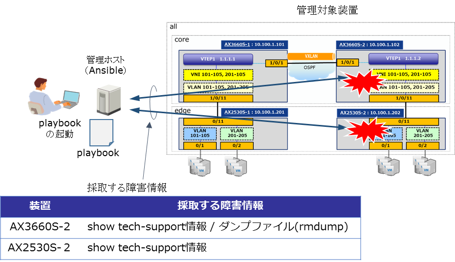

[→目次に戻る](/README.md)

## 4 4  ネットワーク装置の障害情報採取

### 4.4.1 想定シナリオ

#### 4.4.1.1 概要

ポート障害や期待しない動作をしている際に対象のネットワーク装置から障害情報を採取するユースケースです。障害情報を対象のネットワーク装置で生成して、そのファイルを管理ホスト(Ansible)に転送するplaybookの例を示します。

今回、対象とする装置と採取する障害情報は以下のとおりです。

**図 4.4-1 障害情報採取の概要**

#### 4.4.1.2  playbook実行時の動作

　playbook実行時の動作シナリオをplaybookを構成するタスク単位で示します。playbook実行対象は指定した管理対象装置です。

- 作業前の処理
 1. 管理ホスト上に作業結果を格納するディレクトリを作成する

 2. 管理対象装置から装置情報(筐体情報、インタフェース情報、コンフィグレーション、メモリ情報)を収集する

- 障害情報の生成

 3. 「show tech-support情報」を管理対象装置の内蔵フラッシュ上またはRAMDISKに生成する

- 障害情報の確認
 4. 「ダンプファイル(rmdump)※」の存在の有無を確認する 【AX3660Sのみ】

- 障害情報の転送

 5. 「show tech-support情報」を管理対象装置から管理ホストに転送する

 6. 「ダンプファイル(rmdump)」が存在する場合、「ダンプファイル(rmdump)」を管理対象装置から管理ホストに転送する 【AX3660Sのみ】

※ rmdumpは、障害時に\[/dump0\]配下に生成されるダンプファイルで、AX2500Sシリーズにはありません。なお、取得したダンプファイル(rmdump)の情報は、show tech-support情報の中に入っています。

### 4.4.2 使用するモジュール、ディレクティブ、プラグイン

本playbook内で使用しているモジュール、ディレクティブ、プラグインを以下の表に示します。

|モジュール、ディレクティブ、プラグイン名 | 説明 |
|-------------| ----------|
|ax\_command  |2.2.1章参照|
|ax\_facts    |2.2.3章参照|
|prompt, answer |[3.3.9章参照](/N18R001_Ansible_Guide_Chapter3.md)|
|net\_get     |[3.3.7章参照](/N18R001_Ansible_Guide_Chapter3.md)|
|when        |[3.3.2章参照](/N18R001_Ansible_Guide_Chapter3.md)|

### 4.4.3 ファイル・ディレクトリ構成

本playbookを実行させるためのファイル・ディレクトリ構成です。[usecase03](/usecase03)に本playbookの実行に必要なファイル一式を提供しています
~~~yaml
./usecase03                               #　fail_info_get.ymlのカレントディレクトリ
|
|--group_vars                             #　グループ変数用のディレクトリ
|  |--all.yml                             #　グループ全体に適用される変数ファイル|
|
|--hosts		                          #　inventoryファイル
|
|--fail_info_get.yml                      #　障害情報を採取するplaybook
|
|--task_lib                               #　includeされるタスク用のディレクトリ
|  |--ax3600s_task.yml                    #　AX3600Sの場合に実行するタスク
|  |--ax2500s_task.yml                    #　AX2500Sの場合に実行するタスク
~~~

### 4.4.4 group\_vars , host\_vars ,playbook, template

#### 4.4.4.1 グループ変数 (group\_vars)

inventoryで定義したグループ全体に適用される変数です。（ファイル名：[all.yml](/usecase03/group_vars/all.yml)）
~~~yaml
# 認証情報の設定 ★ コネクション方法：network_cliを使用するための変数を定義
ansible_network_os: ax                   # AlaxalaA装置を指定する場合は‘ax’を指定
ansible_user: ユーザ名                    # SSHで装置ログインするユーザ名
ansible_password: パスワード              # SSHで装置ログインする際のパスワード指定
ansible_become: yes                      # 特権モードで実行の場合は ‘yes’に指定
ansible_become_method: enable            # 特権モード移行コマンド ‘enable’を指定
ansible_become_pass: 特権ユーザパスワード  # 特権モードのパスワード指定
~~~

#### 4.4.4.2 ホスト変数　(host\_vars)

本playbookでは管理対象装置ごとに適用する変数はありません。

#### 4.4.4.3 playbook

**(1) 障害情報を取得するplaybook**　（ファイル名：[fail\_info\_get.yml](/usecase03/fail_info_get.yml)）

障害装置に対して、障害情報を取得するplaybookです。全体の処理の視認性を高めるため、各ネットワーク装置ごとに実行するタスクのファイルを分けています。
~~~yaml
- hosts: all
  gather_facts: no
  connection: network_cli
  max_fail_percentage: 0

  vars:
    ansible_command_timeout: 1200

  tasks:
    - name: generate a directory to store result
      file: path="./result/"
            state=directory

    - name: gather ax facts "all"
      ax_facts:
        gather_subset:
          - "all"

    - name: AX3600S do task
      include_tasks: task_lib/ax3600s_task.yml
      when: "'AX36' in ansible_net_model"

    - name: AX2500S do task
      include_tasks: task_lib/ax2500s_task.yml
      when: "'AX25' in ansible_net_model"
~~~

※「ansible\_command\_timeout」は、コマンドの実行時間が長くなるような場合に、タイムアウト時間を延ばすことでタイムアウトを回避することができます。(タイムアウト時間のデフォルトは10秒)
show tech-support情報の生成には時間が掛かるため、タイムアウトの時間は長めに設定してください。

#### 4.4.4.4 各処理を行うタスク

fail\_info\_get.ymlにincludeされるタスクです。

**(1) AX3600Sの場合に実行されるタスク**　（ファイル名：[ax3600s\_task.yml](usecase03/task_lib/ax3600s_task.yml)）
~~~yaml
    - name: do show tech-suport flash
      ax_command:
        commands:
          - command: show tech-support > showtech.txt
            prompt: "Specify Password for Administrator Mode.:"
            answer: "{{ ansible_become_pass }}"

    - name: copy file from network device
      net_get:
        dest: "./result/{{ ansible_net_hostname }}_showtech.txt"
        src: "/mc0/usr/home/alaxala/showtech.txt"
        protocol: scp

    - name: check file rmdump
      ax_command:
        commands: "ls /dump0"
      register: rmdump_check

    - name: copy dump-file from network device
      net_get:
        dest: "./result/{{ ansible_net_hostname }}_rmdump"
        src: "/dump0/rmdump"
        protocol: scp
      when:
        - rmdump_check.stdout[0] == "rmdump"
~~~

**(2) AX2500Sの場合に実行されるタスク**　（ファイル名：[ax2500s\_task.yml](/usecase03/task_lib/ax2500s_task.yml)）
~~~yaml
    - name: do show tech-suport ramdisk
      ax_command:
        commands:
          - command: show tech-support ramdisk

    - name: copy file from　network device
      net_get:
        dest: "./result/{{ ansible_net_hostname }}_showtech.txt"
        src: "/ramdisk/showtech.txt"
        protocol: sftp
~~~

### 4.4.5 実行例

**(1) 実行結果**
~~~yaml
[alaxala@localhost usecase03]$ ansible-playbook -i hosts fail_info_get.yml

PLAY [all] *****************************************************************************************************************************************************************************

TASK [generate a directory to store result] ********************************************************************************************************************************************
changed: [10.100.1.102]
ok: [10.100.1.202]

TASK [gather ax facts "all"] ***********************************************************************************************************************************************************
ok: [10.100.1.102]
ok: [10.100.1.202]

TASK [AX3600S do task] *****************************************************************************************************************************************************************
skipping: [10.100.1.202]
included: /home/alaxala/playbooks/ansible_guide_sample-playbook/usecase03/task_lib/ax3600s_task.yml for 10.100.1.102

TASK [do show tech-suport flash] *******************************************************************************************************************************************************
ok: [10.100.1.102]

TASK [copy file from network device] ***************************************************************************************************************************************************
changed: [10.100.1.102]

TASK [check file rmdump] ***************************************************************************************************************************************************************
ok: [10.100.1.102]

TASK [copy dump-file from network device] **********************************************************************************************************************************************
changed: [10.100.1.102]

TASK [AX2500S do task] *****************************************************************************************************************************************************************
skipping: [10.100.1.102]
included: /home/alaxala/playbooks/ansible_guide_sample-playbook/usecase03/task_lib/ax2500s_task.yml for 10.100.1.202

TASK [do show tech-suport ramdisk] *****************************************************************************************************************************************************
ok: [10.100.1.202]

TASK [copy file from network device] ***************************************************************************************************************************************************
changed: [10.100.1.202]

PLAY RECAP *****************************************************************************************************************************************************************************
10.100.1.102               : ok=7    changed=3    unreachable=0    failed=0    skipped=1    rescued=0    ignored=0
10.100.1.202               : ok=5    changed=1    unreachable=0    failed=0    skipped=1    rescued=0    ignored=0
~~~

**(2) playbookの実行で取得した障害情報**
（ディレクトリ名：result/）
~~~yaml
[alaxala@localhost usecase03]$ ls -l result/
total 12740
-rw-rw-r-- 1 alaxala alaxala 2008312 Sep 26 11:05 AX2530S-2_showtech.txt
-rwxrwxrwx 1 alaxala alaxala 9616622 Sep 26 11:01 AX3660S-2_rmdump
-rw-r--r-- 1 alaxala alaxala 1413412 Sep 26 11:01 AX3660S-2_showtech.txt
~~~

**(3) 本playbookの実行時間**

約6分　（管理対象装置(2台)に対する実行時間）

(注) 弊社環境にて、playbook起動から終了までを計測した時間です。

[→4.5 ネットワーク装置のソフトウェアアップデート](/N18R001_Ansible_Guide_Chapter4.5.md)  
[→目次に戻る](/README.md)