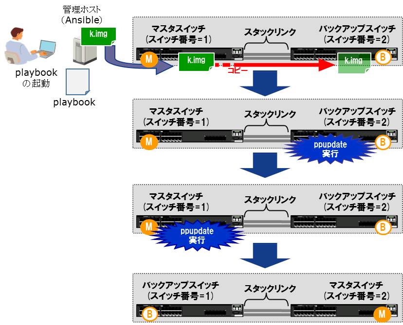

[→目次に戻る](/README.md)

## 4.5 ネットワーク装置のソフトウェアアップデート

### 4.5.1 想定シナリオ

#### 4.5.1.1 概要

脆弱性対応したバージョンのファームウェアにアップデートするユースケースです。AX3660S 2台のスタック構成で、管理ホストからイメージファイルを転送し、バックアップスイッチからマスタスイッチの順番でアップデートを一括実行するplaybookの例を示します。

**図 4.5-1 ソフトウェアアップデートの概要**　

#### 4.5.1.2 playbook実行時の動作

- 作業前の処理

  1. 管理ホスト上に作業結果を格納するディレクトリを作成

  2. 管理対象装置からソフトウェアバージョン情報を収集する

  3. 収集したをソフトウェアバージョン情報を管理ホストに格納する

  4. ソフトウェアイメージファイルを転送するためのファイル容量が、管理対象装置に確保されているか確認する。容量が不足している場合は、playbookを中止する

  5. 管理ホストからソフトウェアイメージファイルを管理対象装置に転送する

  6. アップデートする新しいソフトウェアのバージョンをチェックし、期待外であればplaybookを中止する

- アップデート作業

  7. 現状のスタックの状態からマスタスイッチのスイッチ番号を確認する

  8. マスタスイッチからバックアップスイッチにソフトウェアイメージファイルをコピーする

  9. バックアップスイッチのアップデートを実行し、スタック構成が再構築されるまで待機する

  10. マスタスイッチのアップデートを実行し、スタック構成が再構築されるまで待機する

- 作業後の確認

  11. 管理対象装置から再びソフトウェアバージョン情報を収集する

  12. 収集したソフトウェアバージョン情報を管理ホストに格納する

  13. 作業前のソフトウェアバージョンと作業後のソフトウェアバージョンを比較し差分を管理ホストに格納する

### 4.5.2 使用するモジュール、ディレクティブ、プラグイン

本playbook内で使用しているモジュール、ディレクティブ、プラグインを以下の表に示します。

|モジュール、ディレクティブ、プラグイン名  |説明 |
|--------------------| ------------------|
|ax\_command  | 2.2.1章参照|
|ax\_facts  | 2.2.3章参照|
|set\_fact  | [3.3.5章参照](./N18R001_Ansible_Guide_Chapter3.md)|
|assert  | [3.3.5章参照](./N18R001_Ansible_Guide_Chapter3.md)|
|net\_put  | [3.3.8章参照](./N18R001_Ansible_Guide_Chapter3.md)|
|prompt, answer  | [3.3.9章参照](./N18R001_Ansible_Guide_Chapter3.md)|
|async, poll  |   [3.3.10章参照](./N18R001_Ansible_Guide_Chapter3.md)|
|wait\_for  | [3.3.10章参照](./N18R001_Ansible_Guide_Chapter3.md)|
|stat  | ファイルのステータスを取得します|
|until, retries | リトライ処理を実行します|
|pause |一定時間待ちます|

### 4.5.3 ファイル・ディレクトリ構成

本playbookを実行させるためのファイル・ディレクトリ構成です。[usecase04](/usecase04)に本playbookの実行に必要なファイル一式を提供しています。
~~~yaml
./usecase04                                 #　ppupdate_stack.ymlのカレントディレクトリ
|
|--group_vars                               #　グループ変数用のディレクトリ
|  |--all.yml                               #　グループ全体に適用される変数ファイル
|
|--hosts		                            #　inventoryファイル
|
|--ppupdate_stack.yml               　　　　 #　スタックをppupdateするplaybook
|
|--task_lib                             	#　includeされるタスク用のディレクトリ
|  |--cmp_filesize.yml                      #　ファイルサイズの比較を実行するタスク
|  |--firm_version_check.yml                #　バージョンチェックを実行するタスク
|  |--backup_switch_ppupdate.yml            #　バックアップスイッチのppupdateを実行するタスク
|  |--master_switch_ppupdate.yml            #　マスタスイッチのppupdateを実行するタスク
|
|--firmware                             	#　ファームウェア格納用のディレクトリ
|  |--AX36L3M1201F-312.img.gz               #　アップデート対象のファームウェアファイル(※)
|
|--template                             	#　textFSM用テンプレート用ディレクリ
   |--show_flash.template                   #　show flashをparseするためのテンプレート
   |--show_switch.template                  #　show switchをparseするためのテンプレート
   |--ppupdate_text.template                #　ppupdate実行ログをparseするためのテンプレート
~~~

※ アップデート対象となるファームウェアは、事前に「firmware」フォルダに格納してください。

### 4.5.4  group\_vars , host\_vars ,playbook, template

#### 4.5.4.1 グループ変数 (group\_vars)

inventoryで定義したグループ全体に適用される変数です。（ファイル名：[all.yml](/usecase04/group_vars/all.yml)）
~~~yaml
# 認証情報の設定 ★ コネクション方法：network_cliを使用するための変数を定義
ansible_network_os: ax                     # AlaxalaA装置を指定する場合は‘ax’を指定
ansible_user: ユーザ名                      # SSHで装置ログインするユーザ名
ansible_password: パスワード                # SSHで装置ログインする際のパスワード指定
ansible_become: yes                        # 特権モードで実行の場合は ‘yes’に指定
ansible_become_method: enable              # 特権モード移行コマンド ‘enable’を指定
ansible_become_pass: 特権ユーザパスワード    # 特権モードのパスワード指定

local_firm_path: './firmware/'             # ファームウェアを格納する管理ホスト側のパス指定
remote_firm_path: '/mc0/usr/var/update/'   # ファーウェアを格納するネットワーク装置側のパス指定
firm_filename: 'AX36L3M1201F-312.img.gz'   # ファームウェアのファイル名を指定
firm_check_version: '12.1.F'               # 新しいファームウェアのバージョンを指定
backup_sw: [0,2,1]　　　　　                # スタックの状態からバックアップスイッチのスイッチ番号を指定

template_show_switch: 'template/show_switch.template'        # コメント1
template_show_flash: 'template/show_flash.template'　　　　　 # コメント2
template_ppupdate_text: 'template/ppupdate_text.template'    # コメント3

　　　# コメント1:　show switchの結果から必要な変数を取り出すためのテンプレート
　　　# コメント2:　show flashの結果から必要な変数を取り出すためのテンプレート
　　　# コメント3:　ppupdate実行メッセージの結果から必要な変数を取り出すためのテンプレート
~~~

#### 4.5.4.2  ホスト変数　(host\_vars)

本playbookでは管理対象装置ごとに適用する変数はありません。

#### 4.5.4.3 playbook

スタック構成の装置に対して、バックアップスイッチからマスタスイッチの順番でppupdateを実行するplaybookです。  
（ファイル名：[ppupdate\_stack.yml](/usecase04/ppupdate_stack.yml)）  
全体の処理の視認性を高めるため、各処理を行うタスクのファイルを分けています。
~~~yaml
- hosts: all
  gather_facts: no
  connection: network_cli
  max_fail_percentage: 0

  vars:
    ansible_command_timeout: 1200

  tasks:
    - name: generate a directory to store result
      file: path="./result/"
           state=directory

    - name: check before Version
      ax_command:
        commands:
          - "show version"
      register: show_version_before

    - name: get show version
      copy:
        content: "{{ show_version_before.stdout_lines[0] | join('\n') }}"
        dest: "./result/version_{{ ansible_net_hostname }}_before.txt"

    - name: compare local k.img filesize and network device's free space
      include_tasks: task_lib/cmp_filesize.yml

    - name: firmware Version check
      include_tasks: task_lib/firm_version_check.yml

    - name: execute ppupdate for Backup Switch
      include_tasks: task_lib/backup_switch_ppupdate.yml

    - name: execute ppupdate for Master Switch
      include_tasks: task_lib/master_switch_ppupdate.yml

    - name: check after Version
      ax_command:
        commands:
          - show version
      register: show_version_after

    - name: get show version
      copy:
        content: "{{ show_version_after.stdout_lines[0] | join('\n') }}"
        dest: "./result/version_{{ ansible_net_hostname }}_after.txt"

    - name: get difference between before and after for group "all"
      shell: "diff -u ./result/version_{{ ansible_net_hostname }}_before.txt
                      ./result/version_{{ ansible_net_hostname }}_after.txt
                        > ./result/version_{{ ansible_net_hostname }}_diff.txt"
      register: result_diff
      failed_when: result_diff.rc not in [0, 1]
~~~

※「ansible\_command\_timeout」は、コマンドの実行時間が長くなるような場合に、タイムアウト時間を延ばすことでタイムアウトを回避することができます。(タイムアウト時間のデフォルトは10秒)
ppupdateの実行には時間が掛かるため、タイムアウトの時間は長めに設定してください。

#### 4.5.4.4 各処理を行うタスク

ppupdate\_stack.ymlにincludeされるタスクです。

**(1) ファームウェア容量とネットワーク装置のフラッシュ空き容量を比較するタスク**　
（ファイル名：[cmp\_filesize.yml](/usecase04/task_lib/cmp_filesize.yml)）
~~~yaml
    - name: Get local firmware file size
      stat:
        path: "{{ local_firm_path }}{{ firm_filename }}"
      register: result
      delegate_to: localhost

    - name: Get show flash result
      ax_command:
        commands:
          - show flash
      register: result_show_flash

    - name: Get network device free space
      set_fact:
        flash_free: "{{ result_show_flash.stdout[0] | parse_cli_textfsm( template_show_flash ) }}"

    - name: assert if network device's free space is lower than firmware filesize
      assert:
        that:
          - "{{ flash_free[0].FREE_BYTE|regex_replace(',') }} > result.stat.size/1024"
          - "{{ flash_free[1].FREE_BYTE|regex_replace(',') }} > result.stat.size/1024"

    - name: transfer firmware to network device
      net_put:
        src: "{{ local_firm_path }}{{ firm_filename }}"
        dest: "{{ remote_firm_path }}k.img"
        protocol: scp
~~~
**(2) ファームウェアのアップデートバージョンを確認するタスク**　
（ファイル名：[firm\_version\_check.yml](/usecase04/task_lib/firm_version_check.yml)）
~~~yaml
    - name: get ppupdate text
      ax_command:
        commands:
          - command: ppupdate {{ remote_firm_path }}k.img
            prompt:
              - Do you wish to continue?
            answer: n
      register: ppupdate_text

    - name: parse firmware Current/New Version
      set_fact:
        check_ver: "{{ ppupdate_text.stdout[0] | parse_cli_textfsm( template_ppupdate_text ) }}"

    - name: assert if firmware version is not expected
      assert:
        that:
          - "check_ver[0].NEW_VERSION == firm_check_version"
~~~
**(3) バックアップスイッチのppupdateを実行するタスク**　
（ファイル名：[backup\_switch\_ppupdate.yml](/usecase04/task_lib/backup_switch_ppupdate.yml)）
~~~yaml
    - name: get show switch result
      ax_command:
        commands:
          - "show switch"
      register: show_switch

    - name: check Master Switch
      set_fact:
        check_master: "{{ show_switch.stdout[0] | parse_cli_textfsm( template_show_switch ) }}"
      register: check_master

    - name: copy firmware from Master to Backup
      ax_command:
        commands:
          - command: "cp {{ remote_firm_path }}k.img switch {{ backup_sw[check_master[0].MASTER_SW | int] }} {{ remote_firm_path }}k.img"

    - name: execute ppupdate (Backup Switch)
      ax_command:
        commands:
          - command: "ppupdate switch {{ backup_sw[check_master[0].MASTER_SW | int] }} {{ remote_firm_path }}k.img"
            prompt:
              - "Do you wish to continue?"
            answer: y
      async: 1200
      poll: 5

    - name: check stack status
      ax_command:
        commands:
          - "show switch"
      register: show_switch
      until: ("Backup" in show_switch.stdout[0])
      retries: 50
      delay: 10

    - name: pause 30 seconds
      pause:
        seconds: 30
~~~
**(4) マスタスイッチのppupdateを実行するタスク**　
（ファイル名：[master\_switch\_ppupdate.yml](/usecase04/task_lib/master_switch_ppupdate.yml)）

~~~yaml
    - name: execute ppupdate (Master Switch)
      ax_command:
        commands:
          - command: "ppupdate switch {{ check_master[0].MASTER_SW }} {{ remote_firm_path }}k.img"
            prompt:
              - "Do you wish to continue?"
            answer: y
      async: 1200
      poll: 5

    - name: wait for booting up Backup Switch
      wait_for:
        host: "{{ inventory_hostname }}"
        port: 22
        state: started
        delay: 60

    - name: check stack status
      ax_command:
        commands:
          - "show switch"
      register: show_switch
      until: ("Backup" in show_switch.stdout[0])
      retries: 50
      delay: 10

    - name: pause 30 seconds
      pause:
        seconds: 30
~~~

#### 4.5.4.5 template

**(1) show switchの結果をparseするためのtemplate**
（ファイル名：[show\_switch.template](/usecase04/template/show_switch.template)）
~~~yaml
Value STATUS (\S+)
Value MASTER_SW (\d+)
Value SW_NO (\d+)
Value SW_STAT (\S+)
Value MODEL (\S+)
Value MACHINE (\S+)
Value PRI (\S+)
Value VER (\S+)

Start
  ^Stack status\s*:\s*${STATUS}[ ]{9}Switch No\s*:\s*${MASTER_SW}.*$$
  ^\s${SW_NO}\s+${SW_STAT}\s+${MODEL}\s+${MACHINE}\s+${PRI}\s+${VER} -> Record
~~~

show switchの実行結果（AX3660S-1の例）
~~~
AX3660S-1# show switch
Date 2019/09/26 15:30:43 JST
Stack status : Enable         Switch No : 1
System MAC Address : 0012.e24e.8b41
No  Switch status           Model         Machine ID      Priority  Ver
 1  Master                  3660-48t4xw   0012.e24e.8b41  20        1
 2  Backup                  3660-48t4xw   0012.e24e.c26d  10        1
~~~
TextFSMでparseした結果（AX3660S-1の例）
~~~yaml
    "ansible_facts": {
        "check_master": [
            {
                "MACHINE": "0012.e24e.8b41",
                "MASTER_SW": "1",
                "MODEL": "3660-48t4xw ",
                "PRI": "20",
                "STATUS": "Enable",
                "SW_NO": "1",
                "SW_STAT": "Master",
                "VER": "1"
            },
            {
                "MACHINE": "0012.e24e.c26d",
                "MASTER_SW": "",
                "MODEL": "3660-48t4xw ",
                "PRI": "10",
                "STATUS": "",
                "SW_NO": "2",
                "SW_STAT": "Backup",
                "VER": "1"
            }
~~~

**(2) show flashの結果をparseするためのtemplate**
（ファイル名：[show\_flash.template](/usecase04/template/show_flash.template)）
~~~yaml
Value SW_NO (\d+)
Value STACK_STAT (\S+)
Value USED_BYTE ([0-9,]+)
Value FREE_BYTE ([0-9,]+)
Value TOTAL_BYTE ([0-9,]+)

Start
  ^Switch\s*${SW_NO}\s*${STACK_STAT}.*$$
  ^[ ]{4}used\s+${USED_BYTE}+(?i)kB.*$$
  ^[ ]{4}free\s+${FREE_BYTE}+(?i)kB.*$$
  ^[ ]{4}total\s+${TOTAL_BYTE}+(?i)kB.*$$ -> Record
~~~

show flashの実行結果（AX3660S-1の例）
~~~
AX3660S-1#
AX3660S-1# show flash
Switch 1 (Master)
-----------------
Date 2019/09/26 15:32:29 JST
Flash :
          user area   config area     dump area    area total
    used  140,669KB         121KB      19,664KB     160,454KB
    free  327,787KB     116,941KB     111,344KB     556,072KB
    total 468,456KB     117,062KB     131,008KB     716,526KB

Switch 2 (Backup)
-----------------
Date 2019/09/26 15:32:29 JST
Flash :
          user area   config area     dump area    area total
    used  143,134KB         122KB      19,536KB     162,792KB
    free  325,322KB     116,940KB     111,472KB     553,734KB
    total 468,456KB     117,062KB     131,008KB     716,526KB
~~~

TextFSMでparseした結果（AX3660S-1の例）
~~~yaml
    "ansible_facts": {
        "flash_free": [
            {
                "FREE_BYTE": "327,787",
                "STACK_STAT": "(Master)",
                "SW_NO": "1",
                "TOTAL_BYTE": "468,456",
                "USED_BYTE": "143,134"
            },
            {
                "FREE_BYTE": "325,322",
                "STACK_STAT": "(Backup)",
                "SW_NO": "2",
                "TOTAL_BYTE": "468,456",
                "USED_BYTE": "143,134"
            }
        ]
~~~
**(3) ppupdateの実行結果をparseするためのtemplate**
（ファイル名：[ppupdate\_text.template](/usecase04/template/ppupdate_text.template)）
~~~yaml
Value CURRENT_VERSION (\S+)
Value NEW_VERSION (\S+)

Start
  ^Current\s*version\s*is\s*${CURRENT_VERSION}.*$$
  ^New\s*version\s*is\s*${NEW_VERSION}.*$$ -> Record
~~~

ppupdateの実行結果（AX3660S-1の例）
~~~
AX3660S-1#
AX3660S-1# ppupdate /usr/var/update/k.img

Software update start

Broadcast Message from alaxala@AX3660S-1
        (??) at 15:36 JST...

***********************************************
** UPDATE IS STARTED.                        **
***********************************************

Current version is 12.1.G
New version is 12.1.H
Automatic reboot process will be run after installation process.
Do you wish to continue? (y/n) n
~~~

TextFSMでparseした結果（AX3660S-1の例）
~~~yaml
    "ansible_facts": {
        "check_ver": [
            {
                "CURRENT_VERSION": "12.1.G",
                "NEW_VERSION": "12.1.H"
            }
        ]
~~~

### 4.5.5 実行例

**(1) 実行結果**
~~~yaml
[alaxala@localhost usecase04]$ ansible-playbook -i hosts ppupdate_stack.yml

PLAY [10.100.1.101] ********************************************************************************************************************************************************************

TASK [generate a directory to store result] ********************************************************************************************************************************************
changed: [10.100.1.101]

TASK [gather ax facts "all"] ***********************************************************************************************************************************************************
ok: [10.100.1.101]

TASK [check before Version] ************************************************************************************************************************************************************
ok: [10.100.1.101]

TASK [get show version] ****************************************************************************************************************************************************************
changed: [10.100.1.101]

TASK [compare local k.img filesize and network device's free space] ********************************************************************************************************************
included: /home/alaxala/playbooks/ansible_guide_sample-playbook/usecase04/task_lib/cmp_filesize.yml for 10.100.1.101

TASK [get local firmware file size] ****************************************************************************************************************************************************
ok: [10.100.1.101]

TASK [get show flash result] ***********************************************************************************************************************************************************
ok: [10.100.1.101]

TASK [get network device free space] ***************************************************************************************************************************************************
ok: [10.100.1.101]

TASK [assert if network device's free space is lower than firmware filesize] ***********************************************************************************************************
ok: [10.100.1.101] => {
    "changed": false,
    "msg": "All assertions passed"
}

TASK [transfer firmware to network device] *********************************************************************************************************************************************
changed: [10.100.1.101]

TASK [firmware Version check] **********************************************************************************************************************************************************
included: /home/alaxala/playbooks/ansible_guide_sample-playbook/usecase04/task_lib/firm_version_check.yml for 10.100.1.101

TASK [get ppupdate text] ***************************************************************************************************************************************************************
ok: [10.100.1.101]

TASK [parse firmware Current/New Version] **********************************************************************************************************************************************
ok: [10.100.1.101]

TASK [assert if firmware version is not expected] **************************************************************************************************************************************
ok: [10.100.1.101] => {
    "changed": false,
    "msg": "All assertions passed"
}

TASK [execute ppupdate for Backup Switch] **********************************************************************************************************************************************
included: /home/alaxala/playbooks/ansible_guide_sample-playbook/usecase04/task_lib/backup_switch_ppupdate.yml for 10.100.1.101

TASK [get show switch result] **********************************************************************************************************************************************************
ok: [10.100.1.101]

TASK [check Master Switch] *************************************************************************************************************************************************************
ok: [10.100.1.101]

TASK [copy firmware from Master to Backup] *********************************************************************************************************************************************
ok: [10.100.1.101]

TASK [execute ppupdate (Backup Switch)] ************************************************************************************************************************************************
ok: [10.100.1.101]

TASK [check stack status] **************************************************************************************************************************************************************
FAILED - RETRYING: check stack status (50 retries left).
FAILED - RETRYING: check stack status (49 retries left).
FAILED - RETRYING: check stack status (48 retries left).
FAILED - RETRYING: check stack status (47 retries left).
FAILED - RETRYING: check stack status (46 retries left).
FAILED - RETRYING: check stack status (45 retries left).
FAILED - RETRYING: check stack status (44 retries left).
FAILED - RETRYING: check stack status (43 retries left).
FAILED - RETRYING: check stack status (42 retries left).
ok: [10.100.1.101]

TASK [pause 30 seconds] ****************************************************************************************************************************************************************
Pausing for 30 seconds
(ctrl+C then 'C' = continue early, ctrl+C then 'A' = abort)
ok: [10.100.1.101]

TASK [execute ppupdate for Master Switch] **********************************************************************************************************************************************
included: /home/alaxala/playbooks/ansible_guide_sample-playbook/usecase04/task_lib/master_switch_ppupdate.yml for 10.100.1.101

TASK [execute ppupdate (Master Switch)] ************************************************************************************************************************************************
ok: [10.100.1.101]

TASK [wait for booting up Backup Switch] ***********************************************************************************************************************************************
ok: [10.100.1.101]

TASK [check stack status] **************************************************************************************************************************************************************
FAILED - RETRYING: check stack status (50 retries left).
FAILED - RETRYING: check stack status (49 retries left).
FAILED - RETRYING: check stack status (48 retries left).
FAILED - RETRYING: check stack status (47 retries left).
FAILED - RETRYING: check stack status (46 retries left).
FAILED - RETRYING: check stack status (45 retries left).
FAILED - RETRYING: check stack status (44 retries left).
FAILED - RETRYING: check stack status (43 retries left).
FAILED - RETRYING: check stack status (42 retries left).
FAILED - RETRYING: check stack status (41 retries left).
FAILED - RETRYING: check stack status (40 retries left).
FAILED - RETRYING: check stack status (39 retries left).
FAILED - RETRYING: check stack status (38 retries left).
FAILED - RETRYING: check stack status (37 retries left).
FAILED - RETRYING: check stack status (36 retries left).
FAILED - RETRYING: check stack status (35 retries left).
FAILED - RETRYING: check stack status (34 retries left).
FAILED - RETRYING: check stack status (33 retries left).
FAILED - RETRYING: check stack status (32 retries left).
FAILED - RETRYING: check stack status (31 retries left).
FAILED - RETRYING: check stack status (30 retries left).
FAILED - RETRYING: check stack status (29 retries left).
ok: [10.100.1.101]

TASK [pause 30 seconds] ****************************************************************************************************************************************************************
Pausing for 30 seconds
(ctrl+C then 'C' = continue early, ctrl+C then 'A' = abort)
ok: [10.100.1.101]

TASK [check after Version] *************************************************************************************************************************************************************
ok: [10.100.1.101]

TASK [get show version] ****************************************************************************************************************************************************************
changed: [10.100.1.101]

TASK [get difference between before and after for group "all"] *************************************************************************************************************************
changed: [10.100.1.101]

PLAY RECAP *****************************************************************************************************************************************************************************
10.100.1.101               : ok=29   changed=5    unreachable=0    failed=0    skipped=0    rescued=0    ignored=0
~~~

**(2) 作業前と作業後show versionの差分の比較結果**
（ファイル名：version\_AX3660S-2\_diff.txt）
~~~
[alaxala@localhost usecase04]$ cat result/version_AX3660S-1_diff.txt
--- ./result/version_AX3660S-1_before.txt       2019-09-26 15:48:33.795287231 +0900
+++ ./result/version_AX3660S-1_after.txt        2019-09-26 15:59:41.215998829 +0900
@@ -1,30 +1,30 @@
-Switch 1 (Master)
+Switch 2 (Master)
 -----------------
-Date 2019/09/26 15:46:28 JST
+Date 2019/09/26 15:57:36 JST
 Model: AX3660S-48T4XW
-S/W: OS-L3M Ver. 12.1.G
+S/W: OS-L3M Ver. 12.1.H
 H/W: Main board
-       AX-3660-48T4XW [TB03G048T4X0S408AH1Z074:SL-L3A-001:730F01:0:612:11B567]
+       AX-3660-48T4XW [TB03G048T4X0S408AH3E086:SL-L3A-001:730F01:0:612:11B567]
        Model No.: AX-3660-48T4XW
      Power slot 1 PS-M(AC)
-       AX-F2430-PSA06 [M338SA000JAAP]
+       AX-F2430-PSA06 [M338S8001CAAP]
      Power slot 2 PS-M(AC)
-       AX-F2430-PSA06 [M338S1000FAAP]
+       AX-F2430-PSA06 [M338T4000NAAP]
      Fan slot     FAN-M
-       AX-F2430-FAN04 [TA0FAN040000C1404H3E091]
+       AX-F2430-FAN04 [TA0FAN040000C1404366019]

-Switch 2 (Backup)
+Switch 1 (Backup)
 -----------------
-Date 2019/09/26 15:46:28 JST
+Date 2019/09/26 15:57:37 JST
 Model: AX3660S-48T4XW
-S/W: OS-L3M Ver. 12.1.G
+S/W: OS-L3M Ver. 12.1.H
 H/W: Main board
-       AX-3660-48T4XW [TB03G048T4X0S408AH3E086:SL-L3A-001:730F01:0:612:11B567]
+       AX-3660-48T4XW [TB03G048T4X0S408AH1Z074:SL-L3A-001:730F01:0:612:11B567]
        Model No.: AX-3660-48T4XW
      Power slot 1 PS-M(AC)
-       AX-F2430-PSA06 [M338S8001CAAP]
+       AX-F2430-PSA06 [M338SA000JAAP]
      Power slot 2 PS-M(AC)
-       AX-F2430-PSA06 [M338T4000NAAP]
+       AX-F2430-PSA06 [M338S1000FAAP]
      Fan slot     FAN-M
-       AX-F2430-FAN04 [TA0FAN040000C1404366019]
\ No newline at end of file
+       AX-F2430-FAN04 [TA0FAN040000C1404H3E091]
\ No newline at end of file
~~~

**(3) 本playbookの実行時間**

約12分　（スタック装置に対する実行時間）

(注) 弊社環境にて、playbook起動から終了までを計測した時間です。ファームウェアの書き換え時間や装置の再起動時間を含みます。

[→4.6 NTPサーバ追加，移設にともなうネットワーク装置の設定](/N18R001_Ansible_Guide_Chapter4.6.md)  
[→目次に戻る](/README.md)
