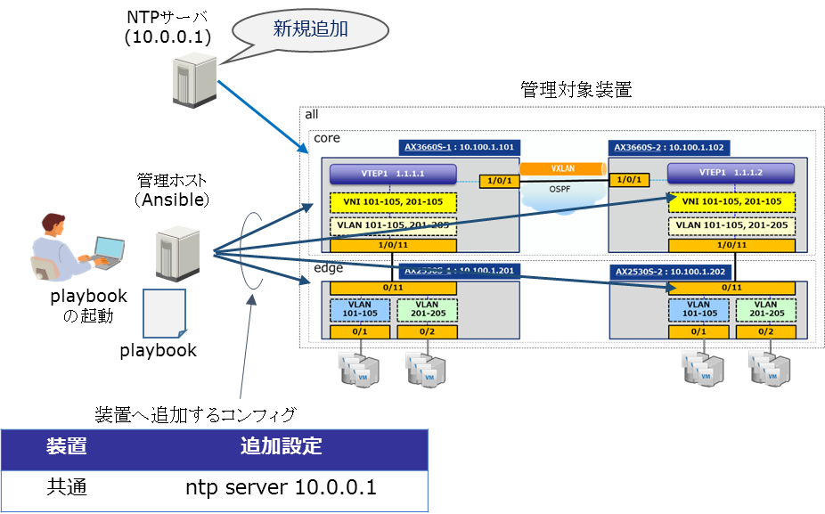
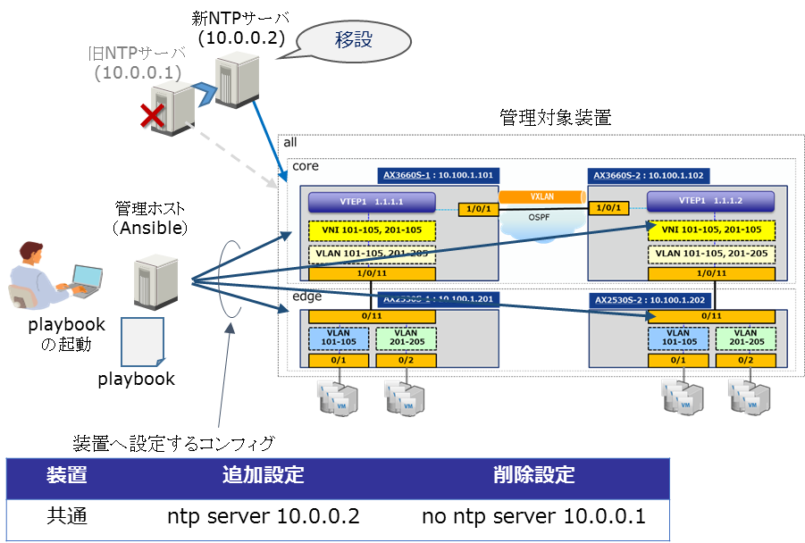

[→目次に戻る](./README.md)

## 4.6  NTPサーバ追加，移設にともなうネットワーク装置の設定

### 4.6.1  想定シナリオ

#### 4.6.1.1 概要

**(a) NTPサーバ追加にともなうネットワーク装置の設定**

自身が所属するエリアにNTPサーバを新規に追加したとき、複数のネットワーク装置にNTPサーバのIPアドレスを設定するユースケースです。新サーバのIPアドレスを追加設定するplaybookの例を示します。

**図 4.6-1 NTPサーバ追加の概要**

**(b) NTPサーバ移設にともなうネットワーク装置の設定**

自身が所属するエリアでNTPサーバが移設されたとき、複数のネットワーク装置にNTPサーバのIPアドレスを設定するユースケースです。新サーバのIPアドレスを追加設定して旧サーバのIPアドレスを削除するplaybookの例を示します。

**図 4.6-2 NTPサーバ移設の概要**

#### 4.6.1.2 playbook実行時の動作

playbook実行時の動作シナリオをplaybookを構成するタスク単位で示します。playbook実行対象は管理対象装置すべてです。

**(a) NTPサーバ追加にともなうネットワーク装置の設定**

- 作業前の処理

  1. 管理対象装置から装置情報(筐体情報、インタフェース情報、コンフィグレーション、メモリ情報)を収集する

- 追加設定

  2. NTPサーバのIPアドレスを追加設定する

- 設定の確認

  3. 管理対象装置から再び装置情報を収集する

  4. 収集したコンフィグレーション（running-config）を管理ホストに格納する

  5. 作業前のコンフィグレーションと作業後のコンフィグレーションを比較し差分を管理ホストに格納する

**(b) NTPサーバ移設にともなうネットワーク装置の設定**

- 作業前の処理

  1. 管理対象装置から装置情報(筐体情報、インタフェース情報、コンフィグレーション、メモリ情報)を収集する

- 追加設定

  2. 新しいNTPサーバのIPアドレスを追加設定する

- 削除設定

  3. 古いNTPサーバのIPアドレスを削除する

- 設定の確認

  4. 管理対象装置から再び装置情報を収集する

  5. 収集したコンフィグレーション（running-config）を管理ホストに格納する

  6. 作業前のコンフィグレーションと作業後のコンフィグレーションを比較し差分を管理ホストに格納する

### 4.6.2  使用するモジュール、ディレクティブ、プラグイン

本playbook内で使用しているモジュール、ディレクティブ、プラグインを以下の表に示します。

|モジュール、ディレクティブ、プラグイン名 |説明 |
|-------------| ----------|
|ax\_config   |2.2.2章参照|
|ax\_facts    |2.2.3章参照|
|copy         |[3.3.6章参照](/N18R001_Ansible_Guide_Chapter3.md)|

### 4.6.3 ファイル・ディレクトリ構成

本playbookを実行させるためのファイル・ディレクトリ構成です。[usecase05](/usecase05)に本playbookの実行に必要なファイル一式を提供しています。
~~~yaml
./usecase05   　　　　　　　　　　　　　　 # カレントディレクトリ
|
|--group_vars                            # グループ変数用のディレクトリ
|  |--all.yml                            # グループ全体に適用される変数ファイル
|
|--hosts                                 # inventoryファイル
|
|--add_server.yml                        # サーバ追加用のplaybook
|
|--replace_server.yml                    # サーバ移設用のplaybook
~~~

### 4.6.4 group\_vars , host\_vars ,playbook, template

#### 4.6.4.1 グループ変数 (group\_vars)

invetoryで定義したグループ全体に適用される変数です。（ファイル名：[all.yml](/usecase05/group_vars/all.yml)）
~~~yaml
# 認証情報の設定 ★ コネクション方法：network_cliを使用するための変数を定義
ansible_network_os: ax                    # AlaxalA装置を指定する場合は‘ax’を指定
ansible_user: ユーザ名                     # SSHで装置ログインするユーザ名
ansible_password: パスワード               # SSHで装置ログインする際のパスワード指定
ansible_become: yes                       # 特権モード(＊)で実行の場合は ‘yes’に指定
ansible_become_method: enable             # 特権モード(＊)移行コマンド ‘enable’を指定
ansible_become_pass: 特権ユーザパスワード   # 特権モード(＊)のパスワード指定
~~~

※「特権モード」はAlaxalA装置の「装置管理者モード」と同義です。

#### 4.6.4.2 ホスト変数　(host\_vars)

本playbookでは管理対象装置ごとに適用する変数はありません。

#### 4.6.4.3 playbook

**(1) NTPサーバを新規に追加するplaybook**　（ファイル名：[add\_server.yml](/usecase05/add_server.yml)）

装置に対して、グループ変数で定義されたサーバのIPアドレスを設定するplaybookです。
~~~yaml
- hosts: all
  gather_facts: no
  connection: network_cli
  max_fail_percentage: 0

  vars:
    add_ntp_server_ip: '10.0.0.1'

  tasks:
    - name: generate a directory to store result
      file: path="./result/"
            state=directory

    - name: gather ax facts "all"
      ax_facts:
        gather_subset:
          - "all"

    - name: copy running-config into rconf_<hostname>_before.cnf
      copy:
        content: "{{ ansible_net_config}}"
        dest: "./result/rconf_{{ ansible_net_hostname }}_before.cnf"

    - name: add ntp server
      ax_config:
        lines:
          - "ntp server {{ add_ntp_server_ip }}"
        save_when: modified

    - name: gather ax facts "all"
      ax_facts:
        gather_subset:
          - "all"

    - name: copy running-config into rconf_<hostname>_after.cnf
      copy:
        content: "{{ ansible_net_config}}"
        dest: "./result/rconf_{{ ansible_net_hostname }}_after.cnf"

    - name: get difference between before and after for group "all"
      shell: "diff -u ./result/rconf_{{ ansible_net_hostname }}_before.cnf
                      ./result/rconf_{{ ansible_net_hostname }}_after.cnf
                        > ./result/rconf_{{ ansible_net_hostname }}_diff.txt"
      register: result_diff
      failed_when: result_diff.rc not in [0, 1]
~~~

**(2) NTPサーバを移設するplaybook** （ファイル名：[replace\_server.yml](/usecase05/replace_server.yml)）

装置に対して、グループ変数で定義された新しいサーバのIPアドレスを設定して、古いサーバのIPアドレスを削除するplaybookです。
~~~yaml
- hosts: all
  gather_facts: no
  connection: network_cli
  max_fail_percentage: 0

　vars:
    old_ntp_server_ip: '10.0.0.1'
    new_ntp_server_ip: '10.0.0.2'

　tasks:
    - name: generate a directory to store result
      file: path="./result/"
            state=directory

    - name: gather ax facts "all"
      ax_facts:
        gather_subset:
          - "all"

    - name: copy running-config into rconf_<hostname>_before.cnf
      copy:
        content: "{{ ansible_net_config}}"
        dest: "./result/rconf_{{ ansible_net_hostname }}_before.cnf"

    - name: add new ntp server
      ax_config:
        lines:
          - ntp server {{ new_ntp_server_ip }}
        save_when: modified

    - name: delete old ntp server
      ax_config:
        lines:
          - no ntp server {{ old_ntp_server_ip }}
        save_when: modified

    - name: gather ax facts "all"
      ax_facts:
        gather_subset:
          - "all"

    - name: copy running-config into rconf_<hostname>_after.cnf
      copy:
        content: "{{ ansible_net_config}}"
        dest: "./result/rconf_{{ ansible_net_hostname }}_after.cnf"

    - name: get difference between before and after for group "all"
      shell: "diff -u ./result/rconf_{{ ansible_net_hostname }}_before.cnf
                      ./result/rconf_{{ ansible_net_hostname }}_after.cnf
                        > ./result/rconf_{{ ansible_net_hostname }}_diff.txt"
      register: result_diff
      failed_when: result_diff.rc not in [0, 1]
~~~

### 4.6.5 実行例

**(1) 実行結果**

**playbookの実行例**
~~~yaml
[alaxala@localhost usecase05]$ ansible-playbook -i hosts add_server.yml

PLAY [all] *****************************************************************************************************************************************

TASK [generate a directory to store result] ********************************************************************************************************
changed: [10.100.1.102]
ok: [10.100.1.101]
ok: [10.100.1.201]
ok: [10.100.1.202]

TASK [gather ax facts "all"] ***********************************************************************************************************************
ok: [10.100.1.102]
ok: [10.100.1.101]
ok: [10.100.1.202]
ok: [10.100.1.201]

TASK [copy running-config into rconf_<hostname>_before.cnf] ****************************************************************************************
changed: [10.100.1.201]
changed: [10.100.1.202]
changed: [10.100.1.102]
changed: [10.100.1.101]

TASK [add ntp server] ******************************************************************************************************************************
changed: [10.100.1.102]
changed: [10.100.1.101]
changed: [10.100.1.201]
changed: [10.100.1.202]

TASK [gather ax facts "all"] ***********************************************************************************************************************
ok: [10.100.1.101]
ok: [10.100.1.102]
ok: [10.100.1.201]
ok: [10.100.1.202]

TASK [copy running-config into rconf_<hostname>_after.cnf] *****************************************************************************************
changed: [10.100.1.101]
changed: [10.100.1.201]
changed: [10.100.1.102]
changed: [10.100.1.202]

TASK [get difference between before and after for group "all"] *************************************************************************************
changed: [10.100.1.101]
changed: [10.100.1.201]
changed: [10.100.1.202]
changed: [10.100.1.102]

PLAY RECAP *****************************************************************************************************************************************
10.100.1.101               : ok=7    changed=4    unreachable=0    failed=0    skipped=0    rescued=0    ignored=0
10.100.1.102               : ok=7    changed=5    unreachable=0    failed=0    skipped=0    rescued=0    ignored=0
10.100.1.201               : ok=7    changed=4    unreachable=0    failed=0    skipped=0    rescued=0    ignored=0
10.100.1.202               : ok=7    changed=4    unreachable=0    failed=0    skipped=0    rescued=0    ignored=0
~~~

**(2) 管理対象装置の操作ログ（AX3660S-1の例）**

**(a) NTPサーバを新規に追加**
~~~
KEY 09/25 12:54:19 alaxala(ttyp0):AX3660S-1(config)# end
KEY 09/25 12:54:18 alaxala(ttyp0):!AX3660S-1(config)# save
KEY 09/25 12:54:18 alaxala(ttyp0):!AX3660S-1# configure terminal
KEY 09/25 12:54:18 alaxala(ttyp0):!AX3660S-1# show startup-config
KEY 09/25 12:54:18 alaxala(ttyp0):!AX3660S-1# show running-config
KEY 09/25 12:54:18 alaxala(ttyp0):y
KEY 09/25 12:54:18 alaxala(ttyp0):!AX3660S-1(config)# end
KEY 09/25 12:54:17 alaxala(ttyp0):AX3660S-1(config)# ntp server 10.0.0.1
KEY 09/25 12:54:17 alaxala(ttyp0):AX3660S-1# configure terminal
KEY 09/25 12:54:17 alaxala(ttyp0):AX3660S-1# show running-config
KEY 09/25 12:54:17 alaxala(ttyp0):AX3660S-1# show version
KEY 09/25 12:54:17 alaxala(ttyp0):AX3660S-1# show system
KEY 09/25 12:54:16 alaxala(ttyp0):AX3660S-1# show version
KEY 09/25 12:54:11 alaxala(ttyp0):AX3660S-1# show running-config
KEY 09/25 12:54:10 alaxala(ttyp0):AX3660S-1# show port
KEY 09/25 12:54:10 alaxala(ttyp0):AX3660S-1# show memory
KEY 09/25 12:54:10 alaxala(ttyp0):AX3660S-1# show version
KEY 09/25 12:54:10 alaxala(ttyp0):AX3660S-1# show system
KEY 09/25 12:54:09 alaxala(ttyp0):AX3660S-1# show version
KEY 09/25 12:53:58 alaxala(ttyp0):AX3660S-1> enable
KEY 09/25 12:53:58 alaxala(ttyp0):AX3660S-1> set logging console disable E9
KEY 09/25 12:53:58 alaxala(ttyp0):AX3660S-1> show version
KEY 09/25 12:53:58 alaxala(ttyp0):AX3660S-1> set terminal pager disable
~~~

**(b) NTPサーバを移設**
~~~
KEY 09/25 13:04:03 alaxala(ttyp0):AX3660S-1(config)# end
KEY 09/25 13:04:03 alaxala(ttyp0):!AX3660S-1(config)# save
KEY 09/25 13:04:02 alaxala(ttyp0):!AX3660S-1# configure terminal
KEY 09/25 13:04:02 alaxala(ttyp0):!AX3660S-1# show startup-config
KEY 09/25 13:04:02 alaxala(ttyp0):!AX3660S-1# show running-config
KEY 09/25 13:04:02 alaxala(ttyp0):y
KEY 09/25 13:04:02 alaxala(ttyp0):!AX3660S-1(config)# end
KEY 09/25 13:04:02 alaxala(ttyp0):AX3660S-1(config)# no ntp server 10.0.0.1
KEY 09/25 13:04:01 alaxala(ttyp0):AX3660S-1# configure terminal
KEY 09/25 13:04:01 alaxala(ttyp0):AX3660S-1# show running-config
KEY 09/25 13:04:01 alaxala(ttyp0):AX3660S-1# show version
KEY 09/25 13:04:01 alaxala(ttyp0):AX3660S-1# show system
KEY 09/25 13:04:01 alaxala(ttyp0):AX3660S-1# show version
KEY 09/25 13:03:55 alaxala(ttyp0):AX3660S-1(config)# end
KEY 09/25 13:03:54 alaxala(ttyp0):!AX3660S-1(config)# save
KEY 09/25 13:03:54 alaxala(ttyp0):!AX3660S-1# configure terminal
KEY 09/25 13:03:54 alaxala(ttyp0):!AX3660S-1# show startup-config
KEY 09/25 13:03:54 alaxala(ttyp0):!AX3660S-1# show running-config
KEY 09/25 13:03:54 alaxala(ttyp0):y
KEY 09/25 13:03:54 alaxala(ttyp0):!AX3660S-1(config)# end
KEY 09/25 13:03:53 alaxala(ttyp0):AX3660S-1(config)# ntp server 10.0.0.2
KEY 09/25 13:03:53 alaxala(ttyp0):AX3660S-1# configure terminal
KEY 09/25 13:03:53 alaxala(ttyp0):AX3660S-1# show running-config
KEY 09/25 13:03:53 alaxala(ttyp0):AX3660S-1# show version
KEY 09/25 13:03:53 alaxala(ttyp0):AX3660S-1# show system
KEY 09/25 13:03:52 alaxala(ttyp0):AX3660S-1# show version
KEY 09/25 13:03:47 alaxala(ttyp0):AX3660S-1# show running-config
KEY 09/25 13:03:46 alaxala(ttyp0):AX3660S-1# show port
KEY 09/25 13:03:46 alaxala(ttyp0):AX3660S-1# show memory
KEY 09/25 13:03:46 alaxala(ttyp0):AX3660S-1# show version
KEY 09/25 13:03:46 alaxala(ttyp0):AX3660S-1# show system
KEY 09/25 13:03:45 alaxala(ttyp0):AX3660S-1# show version
KEY 09/25 13:03:34 alaxala(ttyp0):AX3660S-1> enable
KEY 09/25 13:03:34 alaxala(ttyp0):AX3660S-1> set logging console disable E9
KEY 09/25 13:03:34 alaxala(ttyp0):AX3660S-1> show version
KEY 09/25 13:03:34 alaxala(ttyp0):AX3660S-1> set terminal pager disable
~~~

**(3) 本playbookの実行時間**

約1分　（全管理装置に対する実行時間）

(注) 弊社環境にて、playbook起動から終了までを計測した時間です。

[→目次に戻る](./README.md)
